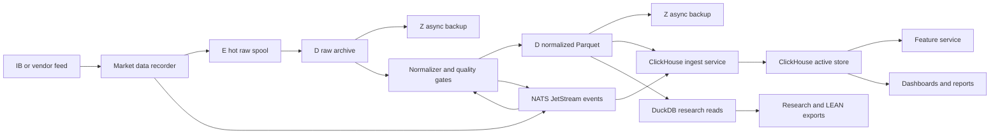

# Columnar Store Target Design

## Status

Decision: use ClickHouse as the primary serving column store, Parquet as the immutable lake/archive and interchange format, and DuckDB as a local/offline research reader over Parquet extracts.

This completes the P2.6 design decision. P2.8 remains responsible for proving the local runtime with Docker and a smoke query.

## Decision Summary

The target columnar path is:

1. Recorder writes raw immutable chunks before publishing any event.
2. Closed raw chunks are copied from the E hot spool to the D local archive and mirrored asynchronously to Z.
3. Normalization jobs write validated Parquet datasets under the archive path and publish normalized events.
4. A columnar ingest service loads normalized records into ClickHouse for fast SQL analytics, dashboards, feature jobs, and replay checks.
5. Research jobs and LEAN export jobs can read either ClickHouse query results or versioned Parquet snapshots. DuckDB is the preferred local tool for ad hoc Parquet reads.

Parquet-first alone is not enough for the target platform because the platform needs an always-on analytical service with ingestion audit, low-latency SQL over recent data, dashboard access, and operational metrics. ClickHouse alone is not enough because raw and normalized archive data must remain portable, immutable, replayable, and easy to back up independently of a running database.

## Roles

| Layer | Role | Primary Location | Notes |
| --- | --- | --- | --- |
| Raw hot spool | Synchronous recorder writes and near-term replay | `E:/systematic_trading_runtime/market-data/hot` | Fast NAND. Short retention and strict watermarks. |
| Raw and normalized archive | Immutable source of replayable data | `D:/systematic_trading_data/market-data` | Larger local disk. Source of truth for closed chunks. |
| Backup archive | Asynchronous safety copy | `Z:/systematic_trading_backup/market-data` | Network drive. Never in the recorder's synchronous write path. |
| ClickHouse active store | Serving SQL store for recent and query-heavy analytics | Docker volume `clickhouse_data` for local Windows; native disk path on Linux/server | Local Windows bind mounts do not satisfy MergeTree rename semantics in the smoke test. Retention must be controlled. |
| DuckDB research reader | Local notebook/script reads over Parquet | No persistent service | Useful for reproducible extracts and offline research. |

Bulk market data must not be written inside the git repository. The recorder storage watermarks remain governed by `config/market-data-storage.json`.

## Local Deployment Path

The local runtime target is Docker Compose:

- Compose file: `deploy/clickhouse/docker-compose.yml`
- Start script: `scripts/start_clickhouse.ps1`
- Stop script: `scripts/stop_clickhouse.ps1`
- Smoke script: `scripts/smoke_clickhouse_columnar_store.ps1`
- Config metadata: `config/columnar-store.json`

Default local ports:

| Port | Use |
| ---: | --- |
| `8123` | HTTP SQL and health checks |
| `9000` | Native ClickHouse client protocol |

Default local paths:

| Variable | Default |
| --- | --- |
| `ST_CLICKHOUSE_LOG_ROOT` | `D:/systematic_trading_data/clickhouse/logs` |
| `ST_CLICKHOUSE_DATABASE` | `systematic_trading` |
| `ST_CLICKHOUSE_USER` | `st_app` |
| `ST_CLICKHOUSE_PASSWORD` | `local-dev-change-me` |

The default password is only a local bootstrap fallback. Serious paper trading and any server deployment must set `ST_CLICKHOUSE_PASSWORD` in the local secret source and must not commit secrets to the repository.

The local Windows runtime uses a Docker-managed `clickhouse_data` volume for `/var/lib/clickhouse`. A direct E-drive bind mount allowed reads and table creation but failed MergeTree inserts during atomic part rename. On a Linux server with native filesystem ownership, replace the Docker volume with a dedicated disk mount after validating write semantics and backups.

## Data Flow

## Table Families

Create schemas by operational domain rather than by source vendor:

| Schema | Table Family | Examples |
| --- | --- | --- |
| `market_data` | Market observations | `bars_1m`, `bars_daily`, `quotes`, `ticks`, `fx_rates` |
| `reference` | Point-in-time reference data | `instrument_snapshots`, `corporate_actions`, `trading_calendars` |
| `features` | Versioned feature outputs | `feature_values`, `feature_batches`, `feature_definitions_snapshot` |
| `ops` | Ingestion and quality audit | `ingestion_batches`, `data_quality_flags`, `replay_audit` |

Common columns:

- `event_date`: exchange or logical observation date.
- `symbol`, `exchange`, `currency`, `asset_class`.
- `source`: vendor or broker source id.
- `vendor_ts`: timestamp supplied by the source.
- `received_at`: recorder receive timestamp in UTC.
- `available_at`: first timestamp when the platform was allowed to use the record.
- `schema_version`: logical data contract version.
- `source_record_id`: stable id for dedupe and replay.
- `ingest_batch_id`: batch/job id that loaded the record.
- `quality_flags`: array or encoded flags for stale, gap-filled, corrected, carried-forward, duplicate, or late data.

Point-in-time queries must filter on `available_at <= decision_at`. Reference and fundamental tables also need valid-time columns when a record can describe an effective period separately from when it became available.

## Table Engine And Keys

Initial ClickHouse tables should use `MergeTree` family engines:

- Bars and FX: partition by month or year of `event_date`, order by `(symbol, event_date, source, available_at)`.
- Quotes and ticks: partition by day or month depending on volume, order by `(symbol, event_date, received_at, source_record_id)`.
- Features: partition by month of feature timestamp, order by `(feature_id, feature_version, symbol, as_of, available_at)`.
- Ingestion audit: partition by run date, order by `(ingest_batch_id, table_name)`.

Do not rely on destructive updates for normal data correction. Store corrected records as new versions with a later `available_at`, preserve raw records in Parquet, and expose current-use views that select the valid record for a decision timestamp.

`ReplicatedMergeTree` and multi-node topology are later server concerns. The local machine starts with single-node `MergeTree` tables.

## Retention

Retention should be explicit per table family:

- Raw hot spool on E: 14 days or the configured hot-spool cap.
- Raw archive on D: retain indefinitely until an explicit archival policy is approved.
- Z backup: retain closed chunks asynchronously, subject to backup watermarks.
- ClickHouse ticks/quotes: start with short retention until feed volume is measured.
- ClickHouse bars, FX, reference, and features: retain enough history for dashboards, research, and LEAN exports; use Parquet archive as the fallback for older data.

Before any high-frequency feed is recorded, add a disk growth estimate and a stop-on-watermark control. Recording must fail closed before filling E or D.

## Ingestion Semantics

Columnar ingest is at-least-once from events and replayable from Parquet:

1. Ingest jobs read normalized events or Parquet batches.
2. Each job writes an `ops.ingestion_batches` row with source paths, event subject, schema version, row count, and checksums.
3. Inserts include `source_record_id` and `ingest_batch_id`.
4. Replay checks compare raw chunk counts, normalized Parquet row counts, ClickHouse row counts, and data-quality flags.
5. Failed batches are not silently retried forever. They create alert and incident events.

Transactional promotion state, approvals, broker orders, fills, incidents, and operator actions remain in Postgres. ClickHouse is not the source of truth for mutable trading workflow state.

## Research And Backtesting Use

Research and backtesting must consume versioned data snapshots:

- Quick interactive research may query ClickHouse directly.
- Reproducible research should export a manifest and Parquet snapshot hash.
- LEAN runs should consume a versioned export built from ClickHouse or Parquet, not a mutable notebook state.
- Strategy promotion evidence must record data inputs, feature versions, query timestamps, and artifact hashes.

## Operational Controls

Minimum checks before relying on the columnar store:

- HTTP health check on `http://127.0.0.1:8123/ping`.
- Disk watermarks for ClickHouse data and logs.
- Ingestion lag from NATS and Parquet batches.
- Row-count reconciliation by source, symbol, date, and batch.
- Query latency and failed-query metrics.
- Part count and merge backlog metrics once sustained ingest starts.
- Backup lag for closed Parquet chunks.

P2.8 should smoke test the local runtime only. P3 and later work must add the real ingestion, quality, metrics, and replay controls.

## References

- ClickHouse Docker install docs: https://clickhouse.com/docs/install/docker
- ClickHouse MergeTree docs: https://clickhouse.com/docs/engines/table-engines/mergetree-family/mergetree
- ClickHouse Parquet format docs: https://clickhouse.com/docs/interfaces/formats/Parquet
- DuckDB Parquet docs: https://duckdb.org/docs/stable/data/parquet/overview
