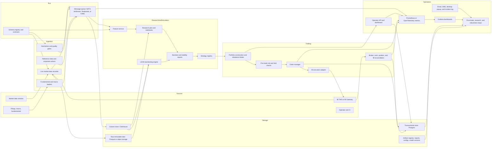

# Industrial Platform Plan

## Project Goal

Build this repository into a 24x7 industrial-standard systematic trading platform for research, backtesting, paper trading, live trading, monitoring, and post-trade analysis. The target standard is institutional discipline: versioned data, reproducible research, explicit promotion gates, resilient services, audited execution, strong reconciliation, and real-time observability.

The current Python/FastAPI/SQLite implementation remains the v0 control plane and research harness. The target state is a service-oriented platform using a message queue, columnar storage, transactional state storage, LEAN-compatible backtesting, Interactive Brokers execution, and Grafana-class monitoring.

The initial schema registry is code-based in `systematic_trading.schemas`; the convention and compatibility rules are documented in `docs/schema-registry-convention.md`.

## Non-Negotiable Principles

- Reliability and auditability come before feature velocity.
- Every strategy, dataset, signal definition, portfolio decision, order intent, broker event, fill, and operator action must be replayable or auditable.
- Research, backtesting, paper trading, and live trading must use the same strategy specification and portfolio construction contracts.
- Paper and live execution must differ by environment configuration and hard controls, not by separate code paths.
- Live trading remains disabled until market data, order routing, reconciliation, alerting, and rollback behavior are proven in paper trading.
- Data must be point-in-time. No live or research decision may depend on data that was unavailable at the decision timestamp.
- Backtests must model execution timing, fees, slippage, corporate actions, FX, calendars, liquidity, and survivorship explicitly.
- Python is acceptable for research, orchestration, and APIs. Go, Rust, or C++ should be introduced only where benchmarks show Python is a bottleneck or a reliability risk.

## Target System Chart

## Core Service Boundaries

### Market Data Recorder

Always-on service that captures live market data and broker market-data responses before downstream processing. It must write immutable raw payloads first, then publish normalized events. This protects post-trade analysis from gaps caused by downstream service failures.

Responsibilities:

- Capture ticks, quotes, bars, order book snapshots where available, FX, broker status, and vendor timestamps.
- Persist raw payloads with source, receive timestamp, sequence id, and schema version.
- Publish normalized events to the message queue.
- Detect stale feeds, gaps, duplicates, clock drift, and vendor disconnects.

Implementation bias:

- Start with Python only if the feed rate is modest.
- Move to Go or Rust when Python cannot meet latency, throughput, memory, or restart guarantees.

### Data Normalization And Quality

Converts raw source payloads into canonical bars, quotes, corporate actions, FX rates, fundamentals, and reference-data records.

Required controls:

- Point-in-time `available_at` timestamps.
- Corporate action adjustment lineage.
- Explicit source precedence.
- Data-quality status flags, not silent overwrites.
- Daily reconciliation against alternate sources.

### Columnar Research Store

Use a column store for fast analytics and historical scans. The selected target is ClickHouse as the serving analytical store, Parquet as the immutable archive and portability layer, and DuckDB as the local/offline Parquet research reader.

The detailed target design is `docs/columnar-store-target-design.md`.

SQLite remains acceptable for local prototypes only. Postgres should become the transactional source of truth for orders, approvals, strategy registry, reconciliation state, incidents, and operator actions.

### Feature Service

Computes and serves point-in-time features to research, backtests, paper trading, and live trading through the same contract.

Required controls:

- Feature definitions are versioned.
- Feature jobs record input data versions.
- Live features must be reproducible from stored data.
- Missing, stale, or late features block promotion and can block trading depending on severity.

### Research And Backtesting

LEAN is the default production-grade backtesting engine because it already handles many hard problems that custom backtesters often miss. The in-repo engine can remain useful for deterministic unit tests and small research loops, but production promotion should require a LEAN or LEAN-equivalent run.

Any custom replacement must prove it handles:

- Point-in-time data availability.
- Survivorship-bias-free universes.
- Corporate actions and dividends.
- Multi-currency portfolios and FX timing.
- Exchange calendars and holidays.
- Fees, commissions, taxes where relevant, and slippage.
- Partial fills, market impact, limit orders, and next-session execution timing.
- Rebalance timing parity between backtest and live.
- Parameter search accounting and out-of-sample validation.

### Strategy Registry And Promotion Control

Every promoted strategy version must include:

- Strategy id and semantic version.
- Universe definition and eligibility rules.
- Data source versions and feature versions.
- Backtest artifact path and report hash.
- In-sample, out-of-sample, and benchmark comparisons.
- Risk limits, turnover limits, liquidity limits, and concentration limits.
- Paper-trading results and reconciliation evidence.
- Operator approval record.
- Rollback plan and kill-switch conditions.

Promotion states:

1. `idea`: informal research concept.
2. `research_candidate`: implemented signal or model with initial diagnostics.
3. `backtest_candidate`: reproducible backtest passes minimum quality checks.
4. `paper_candidate`: approved for paper trading with capital, universe, and risk limits.
5. `shadow_live`: monitored beside intended live behavior without live order routing.
6. `live_enabled`: allowed to place live orders within explicit limits.
7. `retired`: disabled and retained for audit.

### Portfolio Rebalancing Blotter

The blotter is the control point between strategy targets and broker orders. It must be stronger than a simple order preview.

Required behavior:

- Show current positions, target positions, proposed orders, expected cash, FX impact, fees, and residuals.
- Explain each trade by strategy, sleeve, rebalance reason, and risk constraint.
- Enforce pre-trade checks: stale data, missing FX, price bands, buying power, duplicate orders, open orders, max trade size, max turnover, max concentration, restricted symbols, and live capital caps.
- Support approve, reject, resize, defer, and cancel workflows.
- Persist every operator decision and generated order intent.

### Execution Through IB TWS Or Gateway

Interactive Brokers is the execution venue. IB TWS is acceptable for a local workstation; IB Gateway is preferable for server deployment.

Required behavior:

- Separate paper and live accounts, ports, client ids, config, and credentials.
- Use durable local order ids and IB `orderRef` values linked to proposal ids.
- Wait for IB readiness before routing: server time, managed accounts, next valid order id, account match, and connection health.
- Reconcile broker open orders, executions, commissions, cash, and positions before and after submission.
- Make order submission idempotent. A retry must not duplicate exposure.
- Block live orders unless live mode, strategy version, account id, capital cap, and operator approval all match.

### Observability And Alerting

The platform must expose operational state continuously.

Minimum dashboards:

- Service health and restarts.
- Market data freshness and gaps.
- Queue lag and dead letters.
- Database ingest and query latency.
- Strategy signal freshness.
- Portfolio exposures, cash, leverage, drawdown, and turnover.
- Proposal and order lifecycle.
- Broker connection state, open orders, fills, rejects, and reconciliation breaks.
- Daily PnL attribution and slippage.

Alert channels:

- Email for routine failures and daily summaries.
- SMS or push for trading-critical failures.
- Desktop popup on this machine for local operator attention.
- Persistent incident log for review and trend analysis.

## Runtime And Deployment Model

Initial deployment can run on the current machine if it is supervised and monitored. Server deployment should use the same service layout.

Recommended stages:

- Local supervised services on Windows using scheduled tasks or NSSM for early paper trading.
- Docker Compose for repeatable local/server deployment once services split.
- Linux server with systemd or Kubernetes only after service boundaries and persistence are stable.
- Secrets must move from local `.env` files to a controlled secret store before live trading with meaningful capital.

## Language Policy

Default:

- Python for research, analytics, API, reports, orchestration, and low-frequency trading logic.
- SQL for data quality, analytics, and reporting.

Introduce Go or Rust when:

- A process must run 24x7 and recover from high-frequency network or stream events.
- Python p95 or p99 latency misses operational targets.
- CPU or memory use blocks stable operation.
- Deployment as a single static binary materially improves reliability.

Introduce C++ only when:

- Profiling shows numeric simulation or pricing code is the bottleneck.
- Existing libraries cannot meet performance or correctness requirements.

No rewrite should happen without a benchmark and an explicit service contract.

## Research-To-Live Pipeline

```mermaid
flowchart LR
    Idea["Idea"]
    Research["Research implementation"]
    PIT["Point-in-time feature check"]
    Backtest["LEAN backtest and benchmark report"]
    Stability["Stability, robustness, and overfit audit"]
    Review["Promotion review"]
    Paper["Paper trading"]
    Shadow["Shadow live review"]
    Live["Live enabled with caps"]
    Retire["Retire or rollback"]

    Idea --> Research
    Research --> PIT
    PIT --> Backtest
    Backtest --> Stability
    Stability --> Review
    Review --> Paper
    Paper --> Shadow
    Shadow --> Live
    Live --> Retire
    Paper --> Retire
    Review --> Retire
```

Promotion gates:

- Research cannot move forward without a versioned strategy spec.
- Backtesting cannot move forward without point-in-time data controls.
- Paper trading cannot move forward without risk limits and a rebalance blotter.
- Shadow live cannot move forward without broker reconciliation.
- Live trading cannot move forward without alerts, kill switch, rollback, and daily operating loop.

## Daily Operating Loop

### Pre-Market

- Confirm service health, disk space, database availability, queue lag, clock sync, and broker connectivity.
- Confirm market calendars and expected trading sessions.
- Confirm data freshness for all tradable instruments and FX pairs.
- Review pending proposals, open orders, alerts, and unresolved incidents.

### During Market

- Monitor broker connection, market data freshness, order state, fills, rejects, and exposure.
- Capture live market data continuously for post-trade analysis.
- Escalate stale data, queue lag, order rejects, reconciliation breaks, and unexpected exposure changes.

### Post-Close

- Finalize market data and corporate actions.
- Reconcile broker positions, cash, orders, fills, and commissions.
- Produce PnL, attribution, slippage, exposure, and risk reports.
- Compare actual fills with intended execution model.
- Run daily research candidates and robustness checks.
- Stage next rebalance proposals only after data and reconciliation checks pass.
- Update `log.md` with operational status, incidents, research results, and next actions.

## Execution Schedule

### Phase 0: Project Memory And Control Baseline

Target duration: immediate to 2 weeks.

Deliverables:

- Industrial platform plan, architecture memory, log, and agent playbooks.
- Clear current-state versus target-state documentation.
- Live-disabled-by-default policy preserved.
- Current dashboard and paper workflow documented as the v0 control plane.

Exit criteria:

- Any future agent or human can read the docs and understand the target platform, current implementation, promotion rules, and next work.

### Phase 1: Service Foundation

Target duration: 2 to 6 weeks.

Deliverables:

- Message queue selected and running locally.
- Postgres introduced for transactional state.
- ClickHouse or equivalent column store introduced for market data and analytics.
- Event schemas for market data, features, proposals, orders, fills, alerts, and incidents.
- Basic service supervisor and health checks.

Exit criteria:

- A service can publish, persist, replay, and monitor core events without using SQLite as the system of record.

### Phase 2: Market Data Recording And Data Quality

Target duration: 6 to 10 weeks.

Deliverables:

- Always-on recorder for IB and selected vendor feeds.
- Immutable raw data archive.
- Normalized bars, quotes, FX, reference data, and corporate actions in columnar storage.
- Data-quality reports and alerts.
- Replay job that reconstructs a trading day from recorded data.

Exit criteria:

- A full paper-trading day can be replayed from recorded market data and matched to stored decisions.

### Phase 3: LEAN Integration And Promotion Registry

Target duration: 10 to 14 weeks.

Deliverables:

- LEAN-compatible strategy wrapper or export path.
- Strategy registry with versioned strategy specs and artifact links.
- Backtest report templates with benchmark, stability, and overfit diagnostics.
- Promotion workflow from research candidate to paper candidate.

Exit criteria:

- A strategy can be promoted to paper only through reproducible artifacts and explicit approval.

### Phase 4: Paper Trading Hardening

Target duration: 14 to 18 weeks.

Deliverables:

- Strong rebalance blotter.
- IB paper execution adapter hardened for reconnects, retries, partial fills, rejects, and reconciliation.
- Grafana dashboards for data, services, portfolio, and execution.
- Email, SMS or push, desktop popup, and incident-log alerts.
- Daily post-trade report and automated robustness review.

Exit criteria:

- Paper trading runs for multiple weeks with no unresolved reconciliation breaks and no manual database repairs.

### Phase 5: Controlled Live Enablement

Target duration: 18 to 24 weeks, only after Phase 4 evidence.

Deliverables:

- Live account configuration separated from paper.
- Live capital caps, per-order caps, per-symbol caps, turnover caps, and kill switch.
- Dry-run report required before any live route.
- Operator approval for each live proposal.
- Rollback and disable procedure tested.

Exit criteria:

- First live route is small, deliberate, fully reconciled, and reviewed post-trade.

### Phase 6: Continuous Improvement

Ongoing.

Deliverables:

- Daily post-trade analysis.
- Weekly research review.
- Weekly robustness and incident review.
- Monthly strategy promotion or retirement review.
- Quarterly disaster recovery and restore drill.

## Near-Term Implementation Backlog

Track execution status in `docs/execution-kanban.md`. That file is the active Kanban for Done, In Progress, Pending, Review, and Blocked work.

1. Add event schema definitions for market data, proposals, orders, fills, alerts, and incidents.
2. Select initial queue and database stack for single-machine operation.
3. Add Postgres alongside SQLite without breaking current tests.
4. Add ClickHouse or Parquet-first market-data warehouse path.
5. Build the market-data recorder as an isolated service.
6. Add service health checks and metric emission.
7. Build the rebalance blotter model and API.
8. Integrate LEAN for promoted strategy backtests.
9. Add promotion registry tables and artifact hashes.
10. Expand alert channels beyond JSONL and SMTP.
11. Add daily post-trade report generation.
12. Add robustness review automation and incident trend reporting.
