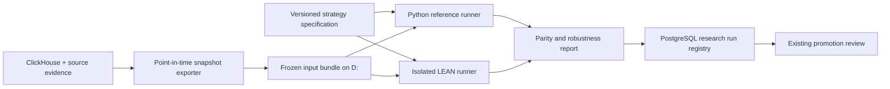

# LEAN backtest integration plan

Decision: 2026-09-25. Implementation session: 2026-09-26. The first isolated
research worker is implemented; see [usage and contract](lean-backtesting.md).
The implementation uses the official pinned open-source engine directly. It
does not promote a strategy or connect LEAN to a brokerage.

## Scope and service boundary

Integrate LEAN as an isolated backtest worker alongside the fast Python engine.
The first workload is the current monthly multi-asset ETF SOTA and its benchmark
from `systematic_trading.research.current_sota_definition`. Keep the Python engine
as a regression oracle. PostgreSQL remains the operational and run-metadata
store; ClickHouse serves market data; frozen files on D: are the actual run inputs.
The worker receives no broker credentials, cannot access Gateway, and cannot
write to approvals, orders or the event outbox. Existing routing, reconciliation,
paper approval and live-disabled gates remain authoritative.

## Work packages and acceptance gates

| Order | Deliverable | Acceptance evidence |
| --- | --- | --- |
| L1 | Versioned input/output contracts and small frozen fixture | Hashes verify; all required inputs have availability timestamps; missing data fails explicitly. |
| L2 | ClickHouse/source-evidence exporter and LEAN data adapter | Price normalization, corporate actions, calendars, symbol mapping and CNH FX fixtures pass; no downloads during a run. |
| L3 | Pinned container runner and Python algorithm wrapper | Repeatable offline runs; timeout/memory/CPU limits, nonzero exit handling and partial-result rejection; no brokerage configuration. |
| L4 | Target replay, then shared strategy computation | Monthly decisions match before comparing execution; no strategy re-optimization to hide engine differences. |
| L5 | Parity and runtime benchmark | Every target/order/cash/NAV discrepancy explained; metrics and resource usage recorded for identical workloads. |
| L6 | Research registry and optional promotion gate | Immutable evidence references, out-of-sample/robustness report, paper evidence, operator approval and rollback link. |

The initial implementation covers adjusted-series engineering parity. Historical
vintage certification, raw corporate actions, delisting/settlement and observed
TWAP scenarios remain later promotion gates, explicitly unsupported by v1's
contract. A LEAN report alone cannot promote a candidate. Runtime evidence and
remaining data limitations are linked from [the worker guide](lean-backtesting.md).

## Input contract

`BacktestRunSpec v1` should include run ID, engine/version/image digest, repository
commit and dirty-tree hash, strategy ID/version/parameter hash, model artifact
hash, random seeds, universe version, calendar/timezone version, data manifest
hash, decision interval, warmup interval, accounting currency, initial cash,
commission/slippage/fill/settlement models, quantity rounding and benchmark ID.

The data manifest records every file's SHA-256, schema, row count, date bounds,
source and license provenance, retrieval time, availability time and normalization.
Use inclusive/exclusive boundary conventions explicitly. Corporate actions need
event/effective/known-at timestamps; instrument mappings include delistings.
Record observed USD/CNH and matched-date cross FX separately from legacy CNY
proxies. Do not treat a restore date or archive timestamp as historical availability.

The existing legacy daily dataset has incomplete point-in-time evidence. It can
support engineering parity experiments labelled `uncertified_legacy`, but cannot
by itself satisfy promotion. Corrected current ClickHouse values are not proof of
what was available at the original decision time. Export versioned source vintages
where available and stop promotion when required vintages are missing.

Start with two data modes: adjusted-series target parity without separately
crediting dividends, and a later raw-price/corporate-action economic simulation.
Never add dividends on top of total-return-adjusted prices. Pin the LEAN
normalization mode and verify how the chosen input maps into it before use.

## Strategy and execution adapter

First replay frozen target weights to isolate engine accounting and execution.
Then wrap the shared pure Python strategy/feature code, exposing only information
available at each decision timestamp. Do not port the technical tree by hand.
Month-end close signals schedule the next tradable session; warmup data cannot
produce trades. Make CNH conversion, cash reserve, leverage/margin and whole-share
rounding explicit. Run cash/settlement tests rather than assume broker defaults.

The reference daily next-open model is one explicit execution scenario. The
production paper TWAP requires a separate scenario with observed minute inputs,
fees and participation/slippage assumptions. Daily OHLC cannot certify TWAP costs.
Initial allocation and 2 percentage point drift maintenance are separate policy
variants, since the canonical monthly benchmark does not include that turnover.
Delayed recorder bars remain labelled and cannot become entitled realtime inputs.

## Outputs and parity criteria

Produce immutable manifest, decisions, features, targets, intended orders, fills,
fees, cash ledger, positions, FX conversions, daily CNH NAV, metrics, logs and
diagnostics. Preserve engine event IDs and map them to run-scoped domain IDs.
Import research evidence only; never synthesize executable proposals or fill events.

Predeclare these engineering tolerances in the run specification:

- Decision timestamps, symbol sets, intended sessions and integer order quantities:
  exact agreement when the two execution policies match.
- Target weights: absolute difference at most 1e-8; flag every larger discrepancy.
- Cash/NAV: compare at identical valuation timestamps, to declared currency
  precision (initially 0.01 CNH), with an explicit rounding/fee/FX attribution.
  Any unexplained discrepancy fails even if cumulative performance looks similar.
- Fees, splits/dividends, settlement timing and intentionally different fill models:
  separate expected differences from errors; never silently widen tolerances.
- Repeat runs: identical normalized economic outputs and hashes, excluding
  documented runtime metadata such as wall-clock execution duration.

Fixtures cover month-end and year-end, US DST, holiday/early close, split/dividend,
missing/stale FX, missing bars, zero volume, warmup insufficiency, symbol changes,
partial fills and fee rounding. Economic coverage beyond US ETFs is a later gate.
Run the canonical in-sample/out-of-sample split without refitting its frozen tree;
add fee/slippage shocks, delayed execution and parameter-neighborhood robustness.

Benchmark both engines on the same fixture, one-year and full-history workloads.
Capture cold/warm elapsed time, peak RSS, CPU, event counts and artifact size on
this machine. No speed advantage is assumed. Investigate differences before
choosing worker concurrency or replacing any existing engine.

## Deployment, licensing and rollback

Use `D:/systematic_trading_data/lean/{datasets,runs,images}` for large artifacts.
Run a pinned LEAN image/commit with read-only input mounts, a dedicated writable
output directory, no `.env` mount, no network during execution, and resource/time
limits. Keep deployment configuration separate from the operating broker process.
Archive a complete run bundle and validate it before atomically marking success.
Cancelled/failed runs retain logs and cannot be promoted. Hash verification precedes
every replay; run metadata should include the data-export and adapter versions.

The official LEAN CLI executes local backtests in Docker and supports a chosen
image. Its supported workflow has organization/subscription requirements; verify
the user's entitlement at implementation time before selecting it. Alternatively,
build the Apache-2.0 open-source engine from a pinned commit and document its build
chain. No paid subscription or cloud upload is authorized by this plan.
[CLI backtest reference](https://www.quantconnect.com/docs/v2/lean-cli/api-reference/lean-backtest),
[CLI getting started](https://www.quantconnect.com/docs/v2/lean-cli/key-concepts/getting-started),
[LEAN source](https://github.com/QuantConnect/Lean).

Validate custom data and reality models against the pinned release:
[custom data](https://www.quantconnect.com/docs/v2/writing-algorithms/importing-data/custom-data),
[reality modeling](https://www.quantconnect.com/docs/v2/writing-algorithms/reality-modeling/key-concepts),
[corporate actions](https://www.quantconnect.com/docs/v2/writing-algorithms/securities/asset-classes/us-equity/corporate-actions).

Rollback disables the LEAN research runner and selects the Python engine. It does
not alter current proposals, broker state or the promoted strategy. Preserve both
engines' evidence. Routing integration is a separate project requiring an explicit
single-writer design, fault/reconnect tests and supervised paper evidence.
