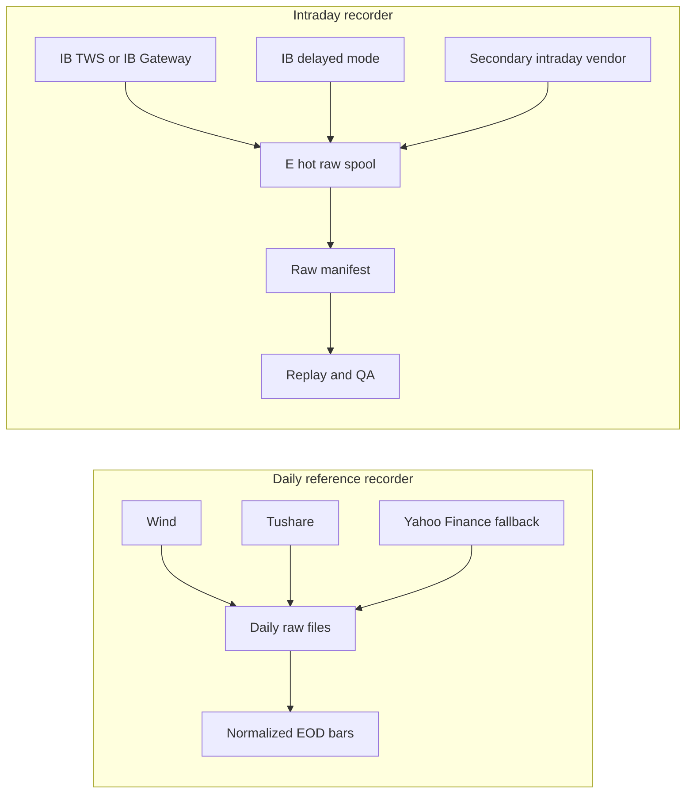

# Market Data Recorder Source Plan

Status: P3.2a source and capacity spec

Decision date: 2026-06-27

This plan extends `docs/market-data-recorder-contract.md`. The recorder contract defines how raw data is written and replayed. This source plan defines what we record first, what limits the recorder must obey, and how the first ETF universe fits inside Interactive Brokers capacity.

## Source Model

The platform should have two recorder lanes.



### Daily Reference Recorder

This lane is already mostly present in the project: it pulls low-frequency daily data from Wind, Tushare, Yahoo Finance, and future paid EOD sources. It is the source for after-close research, rebalance staging, daily PnL, and backfill.

Rules:

- Run after market close or as an explicit historical backfill.
- Record raw vendor responses before normalizing daily bars.
- Keep point-in-time `available_at` semantics for research and promotion.
- Treat Yahoo as a fallback and reconciliation source, not a production source of record.
- Do not mix this lane's daily bars with intraday bars unless a quality job explicitly reconciles them.

### Intraday Recorder

This is the P3.2 implementation lane. It should start with IB because the platform already depends on IB for execution, paper/live account state, and execution feedback.

Rules:

- Record live or paper IB market data during market sessions.
- Store raw callbacks first in the E hot spool, then archive to D and mirror to Z according to `config/market-data-storage.json`.
- Record the IB market data mode for every subscription: `live`, `frozen`, `delayed`, or `delayed_frozen`.
- Record 5-second real-time bars for the full initial ETF universe.
- Keep top-of-book quotes behind a config flag until the recorder proves actual market-data-line use on this machine.
- Limit tick-by-tick recording to a small canary set by default.
- Do not manufacture ticks from 5-second bars.

### Current IB Entitlement Policy

As of 2026-07-13, TWS paper connectivity and delayed streaming are working, but paid API `reqRealTimeBars` entitlements are not active. Do not scale the IB intraday recorder beyond the five-symbol pilot until live subscriptions are confirmed.

Current interim policy:

- Run the always-on recorder with the five-symbol `SPY/QQQ/TLT/GLD/IWM` pilot only; this is recorder validation, not the investible universe.
- Use `delayed-trades` as the interim prospective channel. It aggregates TWS delayed trade price, size, and exchange timestamp callbacks into 5-second bars and records `ib_market_data_mode_delayed` plus `ib_delayed_trade_aggregate` quality flags.
- Keep the 2026-06-29 and 2026-07-13 `reqRealTimeBars` failures as entitlement evidence: IB returned 10089/420 for the pilot symbols.
- Do not use delayed IB data for live trading decisions.
- After July 2026 subscriptions are enabled, run a live-mode entitlement smoke before any broad ETF recording: first 1 symbol, then 5 symbols, then 30-40 symbols only after errors, line usage, and disk growth are reviewed.

## IBKR Capacity Findings

Checked on 2026-06-27.

| Constraint | Official IBKR behavior | Recorder policy |
| --- | --- | --- |
| Level 1 market data subscriptions | Most securities need a Level 1 top-of-book market-data subscription for API market data. TWS data and API data are licensed separately in some cases. | Confirm subscriptions before production recording. Record subscription or delayed fallback status in service state. |
| Default concurrent market data lines | IBKR grants a minimum/default 100 concurrent lines. TWS watchlists and API requests share the same allowance. | Reserve 20 lines for manual TWS, execution, diagnostics, and future services. P3.2 may use up to 80 lines. |
| API request pacing | IBKR documents error code 100 when a client exceeds 50 messages/sec and warns TWS may disconnect the client. | Use an internal token bucket capped at 5-10 new requests/sec. No startup burst should approach IBKR's maximum. |
| 5-second real-time bars | `reqRealTimeBars` provides 5-second bars only, counts against Level 1 market-data subscriptions, and is subject to historical-data pacing. | This is the full-universe high-frequency v0 path. Start <=40 symbols gradually. |
| New real-time-bar requests | Real-time bars are limited to no more than 60 new requests in 600 seconds. | Start subscriptions at <=1 new real-time-bar request every 10 seconds unless explicitly overridden. |
| Historical requests | Max 50 simultaneous open historical requests. Small bars have pacing rules: no identical request within 15 seconds, no six-or-more same contract/exchange/tick-type requests within 2 seconds, and no more than 60 requests in 10 minutes. `BID_ASK` counts double. | Use small concurrent backfills, prefer prospective recording, and schedule catch-up outside trading-critical windows. |
| Historical small-bar retention | IBKR does not provide bars of 30 seconds or less older than six months. | Build our intraday archive prospectively. Do not depend on IB to recover old 5-second data. |
| Tick-by-tick streams | Tick-by-tick capacity scales at about 5% of market data lines; the 100-line example allows 5 tick-by-tick streams. Same-instrument tick-by-tick requests must not repeat within 15 seconds. | Default max is 3 canary symbols, hard cap 5 until market-data-line capacity is raised. |
| Market depth | The 100-line example allows 3 Level 2 market-depth symbols. Level 2 also needs separate subscriptions. | Out of P3.2 scope. Add later only for a research need. |
| Delayed data | TWS API can request live, frozen, delayed, and delayed-frozen market data. Delayed streaming data is available for many instruments, but historical data still requires market-data subscriptions. | Use delayed mode for bootstrapping and source comparison only. Always tag delayed data and block it from live trading decisions. |
| Paper account data sharing | A live user can share market data with one linked paper account. | Prefer paper recording through linked live entitlements. Record account/environment linkage in config, never secrets. |

Capacity conclusion: a 30-40 symbol ETF universe is feasible if P3.2 records 5-second bars for every symbol and optionally adds top-of-book quotes only after a line-usage probe. Tick-by-tick for the whole universe is not feasible at the default allowance.

## Initial ETF Universe Seed

This seed is for recorder capacity testing and research data collection, not a promoted trading universe or recommendation. Before paper use, every symbol needs contract resolution, subscription verification, liquidity checks, corporate-action handling, tax/structure review, and promotion evidence.

| Group | Candidate symbols |
| --- | --- |
| Broad US and global equity | `SPY`, `QQQ`, `IWM`, `DIA`, `MDY`, `VTI`, `URTH`, `ACWI`, `EFA`, `EEM`, `VEA`, `VWO` |
| US sectors | `XLK`, `XLF`, `XLV`, `XLY`, `XLP`, `XLI`, `XLE`, `XLB`, `XLU`, `XLRE`, `XLC` |
| Bonds and credit | `AGG`, `BND`, `TLT`, `IEF`, `SHY`, `TIP`, `LQD`, `HYG`, `MUB`, `EMB` |
| Real assets and commodities | `GLD`, `IAU`, `SLV`, `PDBC`, `DBC`, `VNQ`, `VNQI` |

Seed size: 40 symbols.

Default recording modes:

- Full seed: IB 5-second real-time `TRADES` bars.
- Optional full seed: IB top-of-book quotes after market-data-line probe.
- Canary only: tick-by-tick `Last` or `AllLast` for `SPY`, `QQQ`, and `TLT`; optional `IWM` and `GLD` if capacity is confirmed.
- No default Level 2/depth recording.

## Secondary Intraday Sources

The secondary source should be used for redundancy, delayed backfill, and source-quality comparison. It should not become live-trading source of truth without a promotion decision and contract review.

| Source | Useful for | Limitations and policy |
| --- | --- | --- |
| IB delayed mode | Immediate bootstrapping when live entitlement is absent. | Delayed data must be tagged and excluded from live decisions. IB delayed streaming does not replace historical small-bar retention. |
| Alpaca Market Data | US equity/ETF IEX stream and historical bars; delayed SIP or paid SIP can be useful for cross-checking IB. | Free stream is IEX-only. SIP recent trades/quotes require a subscription; historical SIP without subscription requires `end` at least 15 minutes old. |
| Alpha Vantage Premium | 1, 5, 15, 30, and 60-minute intraday OHLCV, including delayed mode and long historical intraday depth. | REST/backfill style, not a primary live stream. Premium endpoint; rate and license terms must be checked before bulk recording. |
| Massive / Polygon.io | Paid US stock/ETF aggregate bars with delayed and real-time plan tiers. Strong candidate for vendor-grade historical intraday bars. | Paid subscription and license review needed. Use as source comparison or future primary intraday vendor if cost is acceptable. |
| Wind intraday entitlement | Potential local-market and global intraday source if the installed account has rights. | Must verify entitlement, redistribution/storage rights, API limits, and symbol coverage locally before adding to production recorder. |
| Yahoo Finance | Opportunistic recent intraday fallback during research. | Unofficial and not production-grade. Do not use as source of truth. |

## P3.2 Implementation Rules

The first IB recorder slice should implement these controls:

1. Separate process/config identities for `daily_reference_recorder` and `intraday_ib_recorder`.
2. Static universe config plus an IB contract cache keyed by platform symbol, `conId`, exchange, primary exchange, currency, and asset type.
3. Token-bucket pacing with defaults:
   - Level 1/API request cap: 5 requests/sec, burst 10.
   - Real-time-bar cap: 1 new subscription every 10 seconds.
   - Historical small-bar cap: 1 request every 10 seconds for P3.2 backfill/recovery.
   - Tick-by-tick canary cap: 3 active symbols by default, hard cap 5.
4. Market-data-line budget:
   - Assumed total lines: 100 unless TWS probe reports otherwise.
   - Reserved lines: 20.
   - P3.2 usable lines: 80.
   - Startup must fail safe if configured subscriptions exceed budget.
5. Raw callback write before normalized event append.
6. State file must report active symbols, requested data kinds, IB market data mode, records written, last record time, pacing sleeps, disconnects, and IB error-code counts.
7. Pacing, subscription, and stale-feed errors must back off and emit `alert.raised` events.
8. Normalize IB US stock/ETF real-time-bar volume carefully because IB documents a US stock volume multiplier note for real-time bars.
9. Record `source_latency_ms` where source timestamps allow it.
10. Store all bulk output outside the repo through the E/D/Z policy.

## P3.2 v0 Runtime Commands

Realtime session recording for the configured ETF seed:

```powershell
.\.venv\Scripts\python.exe .\scripts\record_ib_market_data.py `
  --mode realtime `
  --use-seed-universe `
  --duration-seconds 3600
```

Current five-symbol delayed testing feed:

```powershell
.\.venv\Scripts\python.exe .\scripts\record_ib_market_data.py `
  --mode delayed-trades `
  --symbols SPY,QQQ,TLT,GLD,IWM `
  --duration-seconds 3600
```

Small closed-market or weekend smoke test against IB historical 5-second bars:

```powershell
.\.venv\Scripts\python.exe .\scripts\record_ib_market_data.py `
  --mode historical-smoke `
  --symbols SPY `
  --historical-duration "60 S" `
  --historical-bar-size "5 secs" `
  --max-bars-per-symbol 3
```

Dry-run raw replay validation for one symbol/day:

```powershell
.\.venv\Scripts\python.exe .\scripts\replay_market_data_raw.py `
  --date 2026-06-27 `
  --symbol SPY
```

Raw catalog rebuild/query for one symbol/day:

```powershell
.\.venv\Scripts\python.exe .\scripts\catalog_market_data_raw.py `
  --rebuild `
  --source interactive-brokers `
  --environment paper `
  --data-kind bar `
  --date 2026-06-27 `
  --symbol SPY
```

The recorder appends `market_data.recorded` events to the configured transactional store after raw writes succeed. The event outbox dispatcher remains responsible for publishing those events to JSONL or NATS.

## Open Decisions

- Confirm exact IB market-data subscriptions for the 40-symbol seed, especially US Network A/B/C coverage and any account-region differences.
- Decide whether to buy quote booster packs if we later want full-universe top-of-book plus tick-by-tick and manual TWS monitoring at the same time.
- Choose the secondary intraday vendor after testing API access and license terms.
- Decide whether local P3.2 uses TWS or IB Gateway. IB Gateway is preferred for 24x7/server deployment, but TWS is acceptable while we debug interactively.
- Treat external VPN dependency as unsafe for 24x7 recording. If VPN, Wi-Fi, or Docker Desktop networking changes, run `scripts/watch_local_platform.ps1 -Repair` and revalidate IB connectivity before restarting the recorder.
- Decide whether commodity funds such as `PDBC` and `DBC` are acceptable in the investible universe after structure/tax review.

## References

- IBKR API market data subscriptions: https://www.interactivebrokers.com/campus/ibkr-api-page/market-data-subscriptions/
- IBKR TWS API documentation and pacing: https://www.interactivebrokers.com/campus/ibkr-api-page/twsapi-doc/
- IBKR TWS API reference: https://www.interactivebrokers.com/campus/ibkr-api-page/twsapi-ref/
- IBKR historical limitations: https://interactivebrokers.github.io/tws-api/historical_limitations.html
- IBKR 5-second real-time bars: https://interactivebrokers.github.io/tws-api/realtime_bars.html
- IBKR tick-by-tick data: https://interactivebrokers.github.io/tws-api/tick_data.html
- IBKR market data types: https://interactivebrokers.github.io/tws-api/market_data_type.html
- IBKR delayed streaming data: https://interactivebrokers.github.io/tws-api/delayed_data.html
- Alpaca market-data FAQ: https://docs.alpaca.markets/us/docs/market-data-faq
- Alpha Vantage API documentation: https://www.alphavantage.co/documentation/
- Massive / Polygon.io custom bars: https://massive.com/docs/rest/stocks/aggregates/custom-bars
