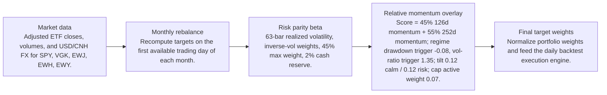
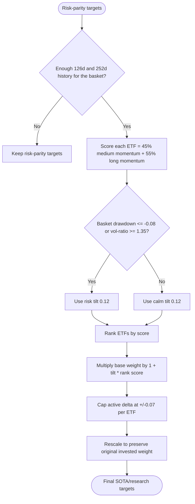
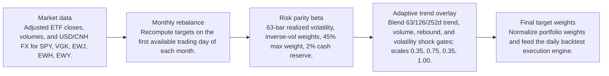
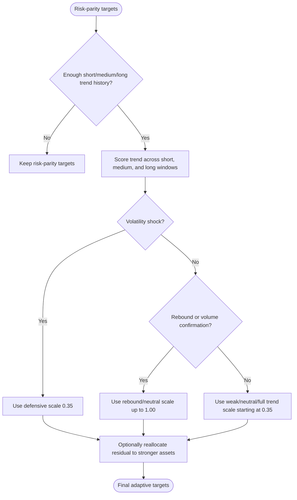

# Signal Comparison

- Baseline: SOTA: risk parity + relative momentum 126/252d regime
- Candidate: Research: risk parity + adaptive-trend-63-126-252d-reallocate-thr-m0p05
- Out-of-sample split: 2023-01-01
- Range: 2012-01-03 to 2026-04-29

| Window | Strategy | Return | Ann. Return | Max DD | Sharpe | Sortino | Calmar | Alpha vs Baseline |
| --- | --- | ---: | ---: | ---: | ---: | ---: | ---: | ---: |
| Full | SOTA: risk parity + relative momentum 126/252d regime | 281.84% | 9.81% | -29.60% | 0.68 | 0.64 | 0.33 | n/a |
| Full | Research: risk parity + adaptive-trend-63-126-252d-reallocate-thr-m0p05 | 205.52% | 8.11% | -29.54% | 0.60 | 0.56 | 0.27 | -76.33% |
| In Sample | SOTA: risk parity + relative momentum 126/252d regime | 110.19% | 6.99% | -29.60% | 0.51 | 0.47 | 0.24 | n/a |
| In Sample | Research: risk parity + adaptive-trend-63-126-252d-reallocate-thr-m0p05 | 69.01% | 4.89% | -29.54% | 0.40 | 0.36 | 0.17 | -41.19% |
| Out Of Sample | SOTA: risk parity + relative momentum 126/252d regime | 82.58% | 19.89% | -12.97% | 1.28 | 1.28 | 1.53 | n/a |
| Out Of Sample | Research: risk parity + adaptive-trend-63-126-252d-reallocate-thr-m0p05 | 81.70% | 19.72% | -13.06% | 1.28 | 1.28 | 1.51 | -0.88% |

Alpha here is candidate return minus baseline return over the same window.

## Model Structure

### Baseline / SOTA

- Name: SOTA: risk parity + relative momentum 126/252d regime
- State: sota
- Promoted on: 2026-05-05
- Description: Monthly risk parity with a regime-gated cross-sectional relative momentum tilt. This is the current research hurdle for new candidate strategies.

#### Layers

#### Decision Tree

### Research Candidate

- Name: Research: risk parity + adaptive-trend-63-126-252d-reallocate-thr-m0p05
- State: research
- Description: Research candidate using adaptive trend exposure scaling.

#### Layers

#### Decision Tree

## Market Data Audit

- Source: SQLite var\systematic_trading.db
- Price field: close
- Adjusted prices validated: yes
- Required observations: 3601
- Common required observations: 3601

| Symbol | Obs. | Required Coverage | Missing Required | Max Gap Days | Stale Runs | Non-Positive |
| --- | ---: | ---: | ---: | ---: | ---: | ---: |
| EWH | 3601 | 100.00% | 0 | 5 | 2 | 0 |
| EWJ | 3601 | 100.00% | 0 | 5 | 1 | 0 |
| EWY | 3601 | 100.00% | 0 | 5 | 0 | 0 |
| SPY | 3601 | 100.00% | 0 | 5 | 0 | 0 |
| VGK | 3601 | 100.00% | 0 | 5 | 0 | 0 |

Warnings:
- EWH has 2 stale close-price runs of at least 3 observations.
- EWJ has 1 stale close-price runs of at least 3 observations.

## Signal Forecast Quality

- Lookback bars: 252
- Threshold: -5.00%
- Forward horizon: next_rebalance

| Window | Obs. | Positive Signals | Negative Signals | Positive Avg Fwd | Negative Avg Fwd | Spread | Accuracy | IC |
| --- | ---: | ---: | ---: | ---: | ---: | ---: | ---: | ---: |
| Full | 790 | 611 | 179 | 0.67% | 1.23% | -0.56% | 55.06% | -0.03 |
| In Sample | 595 | 453 | 142 | 0.40% | 1.03% | -0.63% | 54.79% | -0.06 |
| Out Of Sample | 195 | 158 | 37 | 1.45% | 2.03% | -0.58% | 55.90% | -0.00 |

### Forecast By Symbol

| Symbol | Obs. | Positive Avg Fwd | Negative Avg Fwd | Spread | Accuracy | IC |
| --- | ---: | ---: | ---: | ---: | ---: | ---: |
| EWY | 158 | 1.32% | 0.12% | 1.20% | 55.70% | 0.04 |
| EWJ | 158 | 0.70% | 0.89% | -0.19% | 55.06% | -0.11 |
| EWH | 158 | 0.13% | 1.46% | -1.33% | 49.37% | -0.08 |
| SPY | 158 | 1.05% | 2.61% | -1.55% | 65.82% | -0.10 |
| VGK | 158 | 0.17% | 2.66% | -2.49% | 49.37% | -0.12 |

## Signal Attribution

| Window | Periods | Positive | Negative | Est. Contribution | Compounded Delta | Avg. Period Delta |
| --- | ---: | ---: | ---: | ---: | ---: | ---: |
| Full | 168 | 80 | 88 | -24.53% | -76.33% | -0.14% |
| In Sample | 128 | 61 | 67 | -24.00% | -41.00% | -0.18% |
| Out Of Sample | 40 | 19 | 21 | -0.52% | -0.88% | -0.01% |

### Worst Signal Periods

| Period | Realized Delta | Est. Contribution | Main Negative |
| --- | ---: | ---: | --- |
| 2022-11-01 to 2022-12-01 | -8.13% | -8.39% | EWH underweight (-2.81%, asset 21.44%) |
| 2020-04-01 to 2020-05-01 | -6.40% | -6.45% | SPY underweight (-2.01%, asset 14.89%) |
| 2015-10-01 to 2015-11-02 | -5.40% | -5.45% | SPY underweight (-1.66%, asset 9.50%) |
| 2012-06-01 to 2012-07-02 | -5.20% | -5.23% | EWJ underweight (-1.53%, asset 9.48%) |
| 2019-01-02 to 2019-02-01 | -4.96% | -5.09% | EWH underweight (-1.31%, asset 9.31%) |

### Best Signal Periods

| Period | Realized Delta | Est. Contribution | Main Positive |
| --- | ---: | ---: | --- |
| 2022-09-01 to 2022-10-03 | 5.39% | 5.25% | EWH underweight (1.63%, asset -8.95%) |
| 2022-06-01 to 2022-07-01 | 5.26% | 5.25% | EWY underweight (1.37%, asset -15.10%) |
| 2022-03-01 to 2022-04-01 | 2.12% | 2.12% | SPY overweight (2.83%, asset 5.66%) |
| 2016-03-01 to 2016-04-01 | 1.15% | 1.17% | EWY overweight (1.40%, asset 8.68%) |
| 2018-08-01 to 2018-09-04 | 0.59% | 0.59% | SPY overweight (0.57%, asset 3.19%) |

## Decision Quality

| Window | Active Decisions | Helped | Hurt | Hit Rate | False Exits | Good Exits | False Keeps | Est. Contribution |
| --- | ---: | ---: | ---: | ---: | ---: | ---: | ---: | ---: |
| Full | 827 | 399 | 428 | 48.25% | 263 | 168 | 5 | -24.53% |
| In Sample | 629 | 309 | 320 | 49.13% | 200 | 140 | 5 | -24.00% |
| Out Of Sample | 198 | 90 | 108 | 45.45% | 63 | 28 | 0 | -0.52% |

### Decision Quality By Symbol

| Symbol | Active | Helped | Hurt | Hit Rate | False Exits | False Keeps | Est. Contribution |
| --- | ---: | ---: | ---: | ---: | ---: | ---: | ---: |
| VGK | 166 | 76 | 90 | 45.78% | 51 | 1 | -11.24% |
| EWY | 165 | 67 | 98 | 40.61% | 70 | 1 | -5.67% |
| EWJ | 166 | 83 | 83 | 50.00% | 45 | 1 | -3.85% |
| EWH | 166 | 84 | 82 | 50.60% | 49 | 1 | -3.56% |
| SPY | 164 | 89 | 75 | 54.27% | 48 | 1 | -0.19% |

### Worst False Exits

| Period | Symbol | Action | Asset Return | Est. Contribution |
| --- | --- | --- | ---: | ---: |
| 2022-11-01 to 2022-12-01 | EWH | underweight | 21.44% | -2.81% |
| 2020-04-01 to 2020-05-01 | SPY | underweight | 14.89% | -2.01% |
| 2022-11-01 to 2022-12-01 | EWJ | underweight | 11.53% | -1.85% |
| 2020-05-01 to 2020-06-01 | EWJ | underweight | 10.62% | -1.85% |
| 2015-10-01 to 2015-11-02 | SPY | underweight | 9.50% | -1.66% |

### Worst False Keeps

| Period | Symbol | Asset Return |
| --- | --- | ---: |
| 2012-05-01 to 2012-06-01 | VGK | -14.78% |
| 2012-05-01 to 2012-06-01 | EWY | -13.74% |
| 2012-05-01 to 2012-06-01 | EWH | -11.81% |
| 2012-05-01 to 2012-06-01 | EWJ | -10.27% |
| 2012-05-01 to 2012-06-01 | SPY | -8.94% |