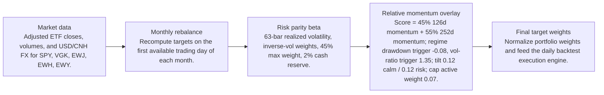
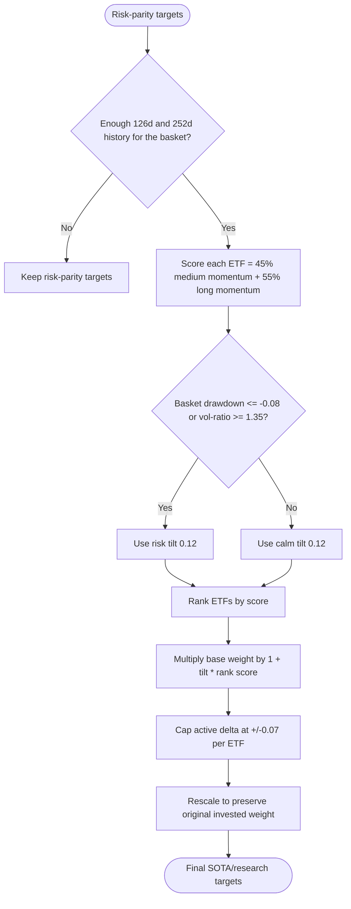
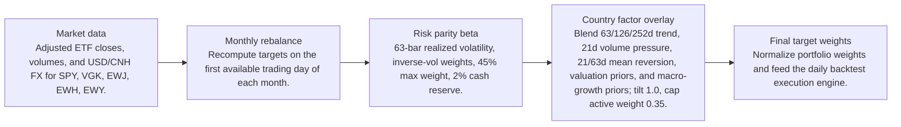
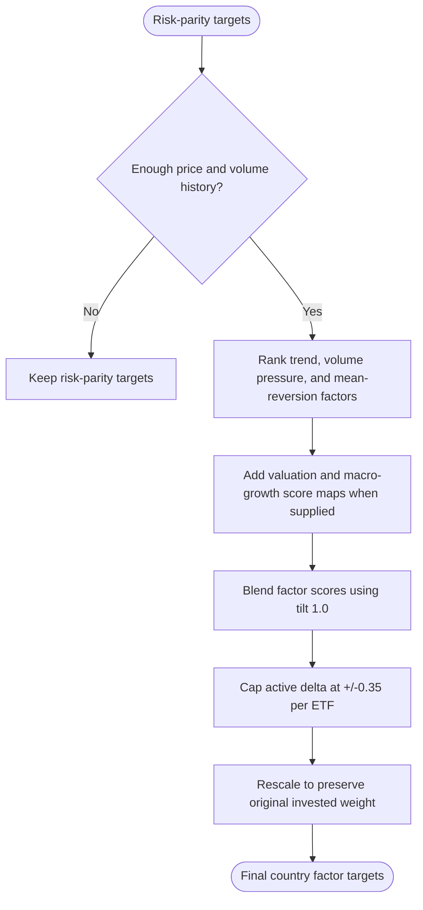

# Signal Comparison

- Baseline: SOTA: risk parity + relative momentum 126/252d regime
- Candidate: Research: risk parity + country-factor-63-126-252d-tilt-1
- Out-of-sample split: 2023-01-01
- Range: 2012-01-03 to 2026-04-29

| Window | Strategy | Return | Ann. Return | Max DD | Sharpe | Sortino | Calmar | Alpha vs Baseline |
| --- | --- | ---: | ---: | ---: | ---: | ---: | ---: | ---: |
| Full | SOTA: risk parity + relative momentum 126/252d regime | 281.84% | 9.81% | -29.60% | 0.68 | 0.64 | 0.33 | n/a |
| Full | Research: risk parity + country-factor-63-126-252d-tilt-1 | 495.00% | 13.26% | -32.79% | 0.83 | 0.79 | 0.40 | 213.16% |
| In Sample | SOTA: risk parity + relative momentum 126/252d regime | 110.19% | 6.99% | -29.60% | 0.51 | 0.47 | 0.24 | n/a |
| In Sample | Research: risk parity + country-factor-63-126-252d-tilt-1 | 188.16% | 10.11% | -32.79% | 0.65 | 0.62 | 0.31 | 77.97% |
| Out Of Sample | SOTA: risk parity + relative momentum 126/252d regime | 82.58% | 19.89% | -12.97% | 1.28 | 1.28 | 1.53 | n/a |
| Out Of Sample | Research: risk parity + country-factor-63-126-252d-tilt-1 | 110.20% | 25.09% | -17.11% | 1.45 | 1.45 | 1.47 | 27.62% |

Alpha here is candidate return minus baseline return over the same window.

## Model Structure

### Baseline / SOTA

- Name: SOTA: risk parity + relative momentum 126/252d regime
- State: sota
- Promoted on: 2026-05-05
- Description: Monthly risk parity with a regime-gated cross-sectional relative momentum tilt. This is the current research hurdle for new candidate strategies.

#### Layers

#### Decision Tree

### Research Candidate

- Name: Research: risk parity + country-factor-63-126-252d-tilt-1
- State: research
- Description: Research candidate using country ETF trend, volume, mean-reversion, valuation, and macro-growth factor tilts.

#### Layers

#### Decision Tree

## Market Data Audit

- Source: SQLite var\systematic_trading.db
- Price field: close
- Adjusted prices validated: yes
- Required observations: 3601
- Common required observations: 3601

| Symbol | Obs. | Required Coverage | Missing Required | Max Gap Days | Stale Runs | Non-Positive |
| --- | ---: | ---: | ---: | ---: | ---: | ---: |
| EWH | 3601 | 100.00% | 0 | 5 | 2 | 0 |
| EWJ | 3601 | 100.00% | 0 | 5 | 1 | 0 |
| EWY | 3601 | 100.00% | 0 | 5 | 0 | 0 |
| SPY | 3601 | 100.00% | 0 | 5 | 0 | 0 |
| VGK | 3601 | 100.00% | 0 | 5 | 0 | 0 |

Warnings:
- EWH has 2 stale close-price runs of at least 3 observations.
- EWJ has 1 stale close-price runs of at least 3 observations.

## Signal Forecast Quality

- Lookback bars: 252
- Threshold: 0.00%
- Forward horizon: next_rebalance

| Window | Obs. | Positive Signals | Negative Signals | Positive Avg Fwd | Negative Avg Fwd | Spread | Accuracy | IC |
| --- | ---: | ---: | ---: | ---: | ---: | ---: | ---: | ---: |
| Full | 790 | 549 | 241 | 0.59% | 1.27% | -0.67% | 54.05% | -0.03 |
| In Sample | 595 | 400 | 195 | 0.29% | 1.10% | -0.81% | 53.61% | -0.06 |
| Out Of Sample | 195 | 149 | 46 | 1.42% | 2.00% | -0.58% | 55.38% | -0.00 |

### Forecast By Symbol

| Symbol | Obs. | Positive Avg Fwd | Negative Avg Fwd | Spread | Accuracy | IC |
| --- | ---: | ---: | ---: | ---: | ---: | ---: |
| EWY | 158 | 1.02% | 0.71% | 0.32% | 52.53% | 0.04 |
| EWJ | 158 | 0.62% | 1.04% | -0.42% | 54.43% | -0.11 |
| EWH | 158 | 0.04% | 1.29% | -1.26% | 49.37% | -0.08 |
| VGK | 158 | 0.24% | 1.69% | -1.45% | 50.00% | -0.12 |
| SPY | 158 | 0.97% | 2.85% | -1.87% | 63.92% | -0.10 |

## Signal Attribution

| Window | Periods | Positive | Negative | Est. Contribution | Compounded Delta | Avg. Period Delta |
| --- | ---: | ---: | ---: | ---: | ---: | ---: |
| Full | 168 | 97 | 71 | 46.88% | 213.16% | 0.28% |
| In Sample | 128 | 75 | 53 | 31.73% | 73.92% | 0.25% |
| Out Of Sample | 40 | 22 | 18 | 15.15% | 27.62% | 0.38% |

### Worst Signal Periods

| Period | Realized Delta | Est. Contribution | Main Negative |
| --- | ---: | ---: | --- |
| 2022-11-01 to 2022-12-01 | -4.41% | -4.53% | EWH cut (-4.49%, asset 21.44%) |
| 2022-12-01 to 2023-01-03 | -4.15% | -4.24% | SPY overweight (-2.80%, asset -6.09%) |
| 2025-02-03 to 2025-03-03 | -4.14% | -4.10% | VGK cut (-1.69%, asset 6.96%) |
| 2013-04-01 to 2013-05-01 | -3.21% | -3.23% | EWJ cut (-2.41%, asset 11.46%) |
| 2022-06-01 to 2022-07-01 | -2.69% | -2.69% | SPY overweight (-3.02%, asset -6.52%) |

### Best Signal Periods

| Period | Realized Delta | Est. Contribution | Main Positive |
| --- | ---: | ---: | --- |
| 2022-10-03 to 2022-11-01 | 5.20% | 5.05% | EWH cut (2.64%, asset -9.78%) |
| 2026-04-01 to 2026-04-29 | 5.20% | 5.22% | SPY overweight (5.19%, asset 8.60%) |
| 2020-04-01 to 2020-05-01 | 4.44% | 4.46% | SPY overweight (7.35%, asset 14.89%) |
| 2024-06-03 to 2024-07-01 | 3.85% | 3.83% | SPY overweight (1.77%, asset 3.66%) |
| 2013-05-01 to 2013-06-03 | 3.53% | 3.55% | SPY overweight (1.87%, asset 3.83%) |

## Decision Quality

| Window | Active Decisions | Helped | Hurt | Hit Rate | False Exits | Good Exits | False Keeps | Est. Contribution |
| --- | ---: | ---: | ---: | ---: | ---: | ---: | ---: | ---: |
| Full | 840 | 425 | 415 | 50.60% | 289 | 215 | 0 | 46.88% |
| In Sample | 640 | 326 | 314 | 50.94% | 216 | 168 | 0 | 31.73% |
| Out Of Sample | 200 | 99 | 101 | 49.50% | 73 | 47 | 0 | 15.15% |

### Decision Quality By Symbol

| Symbol | Active | Helped | Hurt | Hit Rate | False Exits | False Keeps | Est. Contribution |
| --- | ---: | ---: | ---: | ---: | ---: | ---: | ---: |
| EWJ | 168 | 71 | 97 | 42.26% | 97 | 0 | -25.84% |
| VGK | 168 | 70 | 98 | 41.67% | 98 | 0 | -24.61% |
| EWH | 168 | 74 | 94 | 44.05% | 94 | 0 | -20.19% |
| EWY | 168 | 95 | 73 | 56.55% | 0 | 0 | 15.76% |
| SPY | 168 | 115 | 53 | 68.45% | 0 | 0 | 101.76% |

### Worst False Exits

| Period | Symbol | Action | Asset Return | Est. Contribution |
| --- | --- | --- | ---: | ---: |
| 2022-11-01 to 2022-12-01 | EWH | cut | 21.44% | -4.49% |
| 2024-09-03 to 2024-10-01 | EWH | cut | 20.68% | -3.74% |
| 2020-11-02 to 2020-12-01 | EWJ | cut | 11.66% | -3.41% |
| 2020-11-02 to 2020-12-01 | VGK | cut | 17.65% | -2.78% |
| 2022-11-01 to 2022-12-01 | EWJ | cut | 11.53% | -2.77% |

### Worst False Keeps

| Period | Symbol | Asset Return |
| --- | --- | ---: |