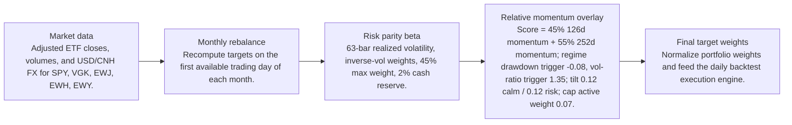
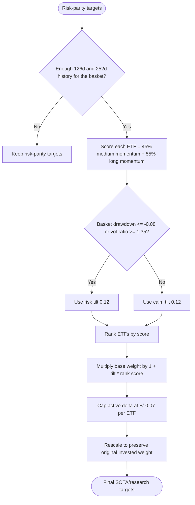
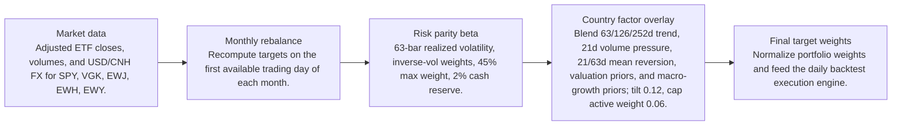
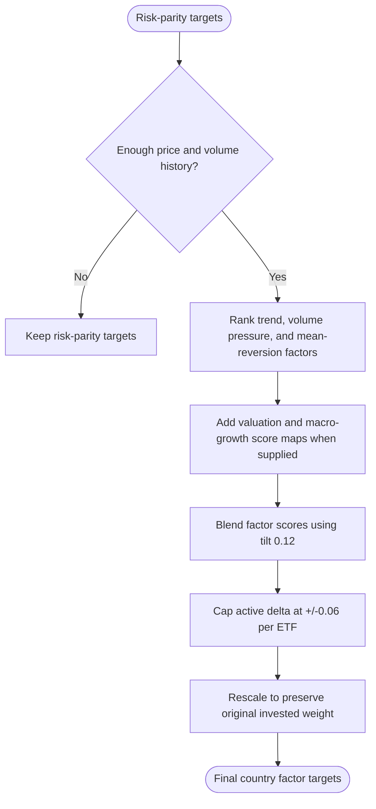

# Signal Comparison

- Baseline: SOTA: risk parity + relative momentum 126/252d regime
- Candidate: Research: risk parity + country-factor-63-126-252d-tilt-0p12
- Out-of-sample split: 2023-01-01
- Range: 2012-01-03 to 2026-04-29

| Window | Strategy | Return | Ann. Return | Max DD | Sharpe | Sortino | Calmar | Alpha vs Baseline |
| --- | --- | ---: | ---: | ---: | ---: | ---: | ---: | ---: |
| Full | SOTA: risk parity + relative momentum 126/252d regime | 281.84% | 9.81% | -29.60% | 0.68 | 0.64 | 0.33 | n/a |
| Full | Research: risk parity + country-factor-63-126-252d-tilt-0p12 | 280.97% | 9.79% | -29.49% | 0.68 | 0.64 | 0.33 | -0.87% |
| In Sample | SOTA: risk parity + relative momentum 126/252d regime | 110.19% | 6.99% | -29.60% | 0.51 | 0.47 | 0.24 | n/a |
| In Sample | Research: risk parity + country-factor-63-126-252d-tilt-0p12 | 110.36% | 7.00% | -29.49% | 0.51 | 0.47 | 0.24 | 0.16% |
| Out Of Sample | SOTA: risk parity + relative momentum 126/252d regime | 82.58% | 19.89% | -12.97% | 1.28 | 1.28 | 1.53 | n/a |
| Out Of Sample | Research: risk parity + country-factor-63-126-252d-tilt-0p12 | 82.03% | 19.78% | -12.88% | 1.28 | 1.28 | 1.54 | -0.54% |

Alpha here is candidate return minus baseline return over the same window.

## Model Structure

### Baseline / SOTA

- Name: SOTA: risk parity + relative momentum 126/252d regime
- State: sota
- Promoted on: 2026-05-05
- Description: Monthly risk parity with a regime-gated cross-sectional relative momentum tilt. This is the current research hurdle for new candidate strategies.

#### Layers

#### Decision Tree

### Research Candidate

- Name: Research: risk parity + country-factor-63-126-252d-tilt-0p12
- State: research
- Description: Research candidate using country ETF trend, volume, mean-reversion, valuation, and macro-growth factor tilts.

#### Layers

#### Decision Tree

## Market Data Audit

- Source: SQLite var\systematic_trading.db
- Price field: close
- Adjusted prices validated: yes
- Required observations: 3601
- Common required observations: 3601

| Symbol | Obs. | Required Coverage | Missing Required | Max Gap Days | Stale Runs | Non-Positive |
| --- | ---: | ---: | ---: | ---: | ---: | ---: |
| EWH | 3601 | 100.00% | 0 | 5 | 2 | 0 |
| EWJ | 3601 | 100.00% | 0 | 5 | 1 | 0 |
| EWY | 3601 | 100.00% | 0 | 5 | 0 | 0 |
| SPY | 3601 | 100.00% | 0 | 5 | 0 | 0 |
| VGK | 3601 | 100.00% | 0 | 5 | 0 | 0 |

Warnings:
- EWH has 2 stale close-price runs of at least 3 observations.
- EWJ has 1 stale close-price runs of at least 3 observations.

## Signal Forecast Quality

- Lookback bars: 252
- Threshold: 0.00%
- Forward horizon: next_rebalance

| Window | Obs. | Positive Signals | Negative Signals | Positive Avg Fwd | Negative Avg Fwd | Spread | Accuracy | IC |
| --- | ---: | ---: | ---: | ---: | ---: | ---: | ---: | ---: |
| Full | 790 | 549 | 241 | 0.59% | 1.27% | -0.67% | 54.05% | -0.03 |
| In Sample | 595 | 400 | 195 | 0.29% | 1.10% | -0.81% | 53.61% | -0.06 |
| Out Of Sample | 195 | 149 | 46 | 1.42% | 2.00% | -0.58% | 55.38% | -0.00 |

### Forecast By Symbol

| Symbol | Obs. | Positive Avg Fwd | Negative Avg Fwd | Spread | Accuracy | IC |
| --- | ---: | ---: | ---: | ---: | ---: | ---: |
| EWY | 158 | 1.02% | 0.71% | 0.32% | 52.53% | 0.04 |
| EWJ | 158 | 0.62% | 1.04% | -0.42% | 54.43% | -0.11 |
| EWH | 158 | 0.04% | 1.29% | -1.26% | 49.37% | -0.08 |
| VGK | 158 | 0.24% | 1.69% | -1.45% | 50.00% | -0.12 |
| SPY | 158 | 0.97% | 2.85% | -1.87% | 63.92% | -0.10 |

## Signal Attribution

| Window | Periods | Positive | Negative | Est. Contribution | Compounded Delta | Avg. Period Delta |
| --- | ---: | ---: | ---: | ---: | ---: | ---: |
| Full | 168 | 80 | 88 | -0.21% | -0.87% | -0.00% |
| In Sample | 128 | 63 | 65 | 0.10% | 0.15% | 0.00% |
| Out Of Sample | 40 | 17 | 23 | -0.31% | -0.54% | -0.01% |

### Worst Signal Periods

| Period | Realized Delta | Est. Contribution | Main Negative |
| --- | ---: | ---: | --- |
| 2026-02-02 to 2026-03-02 | -0.26% | -0.26% | EWY underweight (-0.19%, asset 22.00%) |
| 2024-01-02 to 2024-02-01 | -0.23% | -0.23% | EWH overweight (-0.10%, asset -6.26%) |
| 2013-04-01 to 2013-05-01 | -0.22% | -0.22% | EWJ underweight (-0.21%, asset 11.46%) |
| 2025-10-01 to 2025-11-03 | -0.21% | -0.22% | EWY underweight (-0.25%, asset 23.07%) |
| 2025-12-01 to 2026-01-02 | -0.19% | -0.19% | EWY underweight (-0.13%, asset 15.33%) |

### Best Signal Periods

| Period | Realized Delta | Est. Contribution | Main Positive |
| --- | ---: | ---: | --- |
| 2023-05-01 to 2023-06-01 | 0.27% | 0.26% | EWH underweight (0.13%, asset -8.22%) |
| 2023-01-03 to 2023-02-01 | 0.27% | 0.27% | EWY overweight (0.32%, asset 17.46%) |
| 2022-10-03 to 2022-11-01 | 0.23% | 0.22% | EWY overweight (0.16%, asset 8.86%) |
| 2024-09-03 to 2024-10-01 | 0.23% | 0.23% | EWH overweight (0.27%, asset 20.68%) |
| 2022-07-01 to 2022-08-01 | 0.22% | 0.22% | EWH underweight (0.10%, asset -4.83%) |

## Decision Quality

| Window | Active Decisions | Helped | Hurt | Hit Rate | False Exits | Good Exits | False Keeps | Est. Contribution |
| --- | ---: | ---: | ---: | ---: | ---: | ---: | ---: | ---: |
| Full | 839 | 420 | 419 | 50.06% | 246 | 168 | 0 | -0.21% |
| In Sample | 640 | 323 | 317 | 50.47% | 185 | 134 | 0 | 0.10% |
| Out Of Sample | 199 | 97 | 102 | 48.74% | 61 | 34 | 0 | -0.31% |

### Decision Quality By Symbol

| Symbol | Active | Helped | Hurt | Hit Rate | False Exits | False Keeps | Est. Contribution |
| --- | ---: | ---: | ---: | ---: | ---: | ---: | ---: |
| EWY | 167 | 70 | 97 | 41.92% | 44 | 0 | -1.48% |
| SPY | 168 | 73 | 95 | 43.45% | 82 | 0 | -0.96% |
| EWJ | 168 | 92 | 76 | 54.76% | 46 | 0 | 0.39% |
| EWH | 168 | 94 | 74 | 55.95% | 33 | 0 | 0.67% |
| VGK | 168 | 91 | 77 | 54.17% | 41 | 0 | 1.17% |

### Worst False Exits

| Period | Symbol | Action | Asset Return | Est. Contribution |
| --- | --- | --- | ---: | ---: |
| 2020-04-01 to 2020-05-01 | SPY | underweight | 14.89% | -0.30% |
| 2025-10-01 to 2025-11-03 | EWY | underweight | 23.07% | -0.25% |
| 2020-11-02 to 2020-12-01 | EWY | underweight | 18.01% | -0.25% |
| 2020-12-01 to 2021-01-04 | EWY | underweight | 14.23% | -0.22% |
| 2013-04-01 to 2013-05-01 | EWJ | underweight | 11.46% | -0.21% |

### Worst False Keeps

| Period | Symbol | Asset Return |
| --- | --- | ---: |