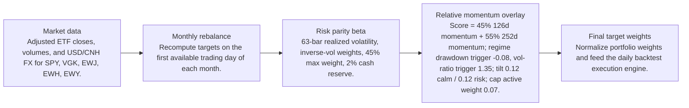
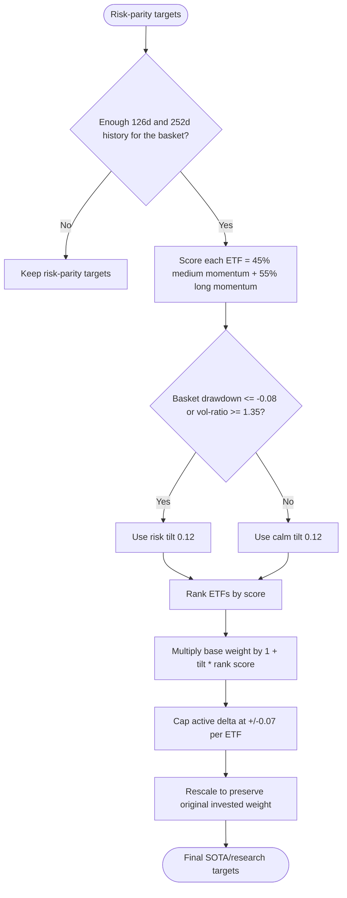
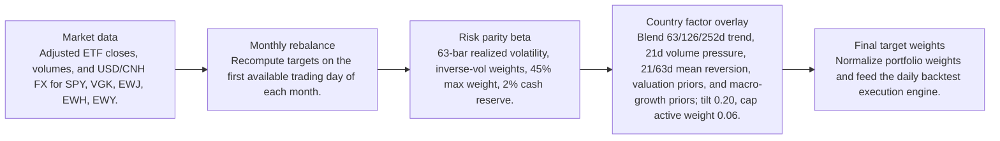
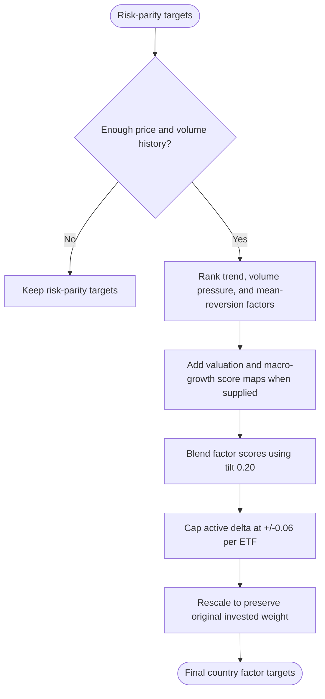

# Signal Comparison

- Baseline: SOTA: risk parity + relative momentum 126/252d regime
- Candidate: Research: risk parity + country-factor-63-126-252d-tilt-0p2
- Out-of-sample split: 2023-01-01
- Range: 2012-01-03 to 2026-04-29

| Window | Strategy | Return | Ann. Return | Max DD | Sharpe | Sortino | Calmar | Alpha vs Baseline |
| --- | --- | ---: | ---: | ---: | ---: | ---: | ---: | ---: |
| Full | SOTA: risk parity + relative momentum 126/252d regime | 281.84% | 9.81% | -29.60% | 0.68 | 0.64 | 0.33 | n/a |
| Full | Research: risk parity + country-factor-63-126-252d-tilt-0p2 | 281.95% | 9.81% | -29.69% | 0.68 | 0.64 | 0.33 | 0.10% |
| In Sample | SOTA: risk parity + relative momentum 126/252d regime | 110.19% | 6.99% | -29.60% | 0.51 | 0.47 | 0.24 | n/a |
| In Sample | Research: risk parity + country-factor-63-126-252d-tilt-0p2 | 108.89% | 6.93% | -29.69% | 0.51 | 0.47 | 0.23 | -1.30% |
| Out Of Sample | SOTA: risk parity + relative momentum 126/252d regime | 82.58% | 19.89% | -12.97% | 1.28 | 1.28 | 1.53 | n/a |
| Out Of Sample | Research: risk parity + country-factor-63-126-252d-tilt-0p2 | 83.76% | 20.13% | -12.96% | 1.29 | 1.30 | 1.55 | 1.19% |

Alpha here is candidate return minus baseline return over the same window.

## Model Structure

### Baseline / SOTA

- Name: SOTA: risk parity + relative momentum 126/252d regime
- State: sota
- Promoted on: 2026-05-05
- Description: Monthly risk parity with a regime-gated cross-sectional relative momentum tilt. This is the current research hurdle for new candidate strategies.

#### Layers

#### Decision Tree

### Research Candidate

- Name: Research: risk parity + country-factor-63-126-252d-tilt-0p2
- State: research
- Description: Research candidate using country ETF trend, volume, mean-reversion, valuation, and macro-growth factor tilts.

#### Layers

#### Decision Tree

## Market Data Audit

- Source: SQLite var\systematic_trading.db
- Price field: close
- Adjusted prices validated: yes
- Required observations: 3601
- Common required observations: 3601

| Symbol | Obs. | Required Coverage | Missing Required | Max Gap Days | Stale Runs | Non-Positive |
| --- | ---: | ---: | ---: | ---: | ---: | ---: |
| EWH | 3601 | 100.00% | 0 | 5 | 2 | 0 |
| EWJ | 3601 | 100.00% | 0 | 5 | 1 | 0 |
| EWY | 3601 | 100.00% | 0 | 5 | 0 | 0 |
| SPY | 3601 | 100.00% | 0 | 5 | 0 | 0 |
| VGK | 3601 | 100.00% | 0 | 5 | 0 | 0 |

Warnings:
- EWH has 2 stale close-price runs of at least 3 observations.
- EWJ has 1 stale close-price runs of at least 3 observations.

## Signal Forecast Quality

- Lookback bars: 252
- Threshold: 0.00%
- Forward horizon: next_rebalance

| Window | Obs. | Positive Signals | Negative Signals | Positive Avg Fwd | Negative Avg Fwd | Spread | Accuracy | IC |
| --- | ---: | ---: | ---: | ---: | ---: | ---: | ---: | ---: |
| Full | 790 | 549 | 241 | 0.59% | 1.27% | -0.67% | 54.05% | -0.03 |
| In Sample | 595 | 400 | 195 | 0.29% | 1.10% | -0.81% | 53.61% | -0.06 |
| Out Of Sample | 195 | 149 | 46 | 1.42% | 2.00% | -0.58% | 55.38% | -0.00 |

### Forecast By Symbol

| Symbol | Obs. | Positive Avg Fwd | Negative Avg Fwd | Spread | Accuracy | IC |
| --- | ---: | ---: | ---: | ---: | ---: | ---: |
| EWY | 158 | 1.02% | 0.71% | 0.32% | 52.53% | 0.04 |
| EWJ | 158 | 0.62% | 1.04% | -0.42% | 54.43% | -0.11 |
| EWH | 158 | 0.04% | 1.29% | -1.26% | 49.37% | -0.08 |
| VGK | 158 | 0.24% | 1.69% | -1.45% | 50.00% | -0.12 |
| SPY | 158 | 0.97% | 2.85% | -1.87% | 63.92% | -0.10 |

## Signal Attribution

| Window | Periods | Positive | Negative | Est. Contribution | Compounded Delta | Avg. Period Delta |
| --- | ---: | ---: | ---: | ---: | ---: | ---: |
| Full | 168 | 83 | 85 | 0.02% | 0.10% | 0.00% |
| In Sample | 128 | 60 | 68 | -0.66% | -1.29% | -0.01% |
| Out Of Sample | 40 | 23 | 17 | 0.68% | 1.19% | 0.02% |

### Worst Signal Periods

| Period | Realized Delta | Est. Contribution | Main Negative |
| --- | ---: | ---: | --- |
| 2022-11-01 to 2022-12-01 | -0.29% | -0.28% | EWH underweight (-0.45%, asset 21.44%) |
| 2020-05-01 to 2020-06-01 | -0.19% | -0.17% | EWY underweight (-0.10%, asset 10.23%) |
| 2020-06-01 to 2020-07-01 | -0.15% | -0.15% | EWH underweight (-0.13%, asset 7.01%) |
| 2024-09-03 to 2024-10-01 | -0.14% | -0.14% | EWH underweight (-0.19%, asset 20.68%) |
| 2013-05-01 to 2013-06-03 | -0.14% | -0.14% | EWJ overweight (-0.10%, asset -7.43%) |

### Best Signal Periods

| Period | Realized Delta | Est. Contribution | Main Positive |
| --- | ---: | ---: | --- |
| 2026-02-02 to 2026-03-02 | 0.19% | 0.19% | EWY overweight (0.20%, asset 22.00%) |
| 2020-12-01 to 2021-01-04 | 0.18% | 0.18% | EWY overweight (0.22%, asset 14.23%) |
| 2025-10-01 to 2025-11-03 | 0.16% | 0.16% | EWY overweight (0.13%, asset 23.07%) |
| 2023-01-03 to 2023-02-01 | 0.16% | 0.16% | VGK overweight (0.18%, asset 9.44%) |
| 2024-11-01 to 2024-12-02 | 0.15% | 0.15% | SPY overweight (0.08%, asset 5.71%) |

## Decision Quality

| Window | Active Decisions | Helped | Hurt | Hit Rate | False Exits | Good Exits | False Keeps | Est. Contribution |
| --- | ---: | ---: | ---: | ---: | ---: | ---: | ---: | ---: |
| Full | 837 | 430 | 407 | 51.37% | 246 | 177 | 0 | 0.02% |
| In Sample | 637 | 322 | 315 | 50.55% | 188 | 136 | 0 | -0.66% |
| Out Of Sample | 200 | 108 | 92 | 54.00% | 58 | 41 | 0 | 0.68% |

### Decision Quality By Symbol

| Symbol | Active | Helped | Hurt | Hit Rate | False Exits | False Keeps | Est. Contribution |
| --- | ---: | ---: | ---: | ---: | ---: | ---: | ---: |
| EWH | 167 | 79 | 88 | 47.31% | 50 | 0 | -0.85% |
| SPY | 168 | 90 | 78 | 53.57% | 39 | 0 | -0.47% |
| VGK | 167 | 81 | 86 | 48.50% | 51 | 0 | 0.35% |
| EWJ | 167 | 93 | 74 | 55.69% | 53 | 0 | 0.49% |
| EWY | 168 | 87 | 81 | 51.79% | 53 | 0 | 0.51% |

### Worst False Exits

| Period | Symbol | Action | Asset Return | Est. Contribution |
| --- | --- | --- | ---: | ---: |
| 2022-11-01 to 2022-12-01 | EWH | underweight | 21.44% | -0.45% |
| 2012-06-01 to 2012-07-02 | VGK | underweight | 11.62% | -0.36% |
| 2020-11-02 to 2020-12-01 | VGK | underweight | 17.65% | -0.32% |
| 2012-12-03 to 2013-01-02 | EWJ | underweight | 8.69% | -0.26% |
| 2020-04-01 to 2020-05-01 | VGK | underweight | 9.01% | -0.20% |

### Worst False Keeps

| Period | Symbol | Asset Return |
| --- | --- | ---: |