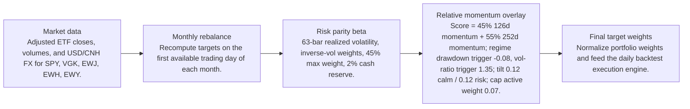
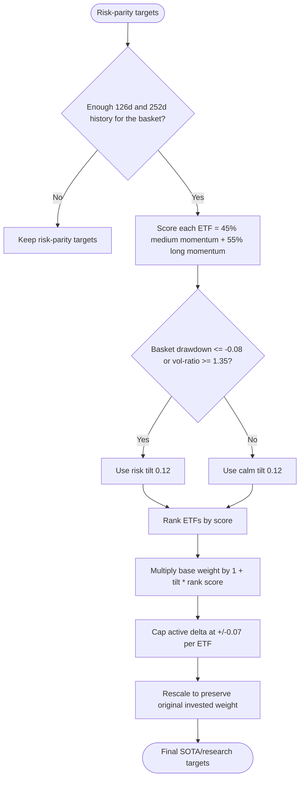
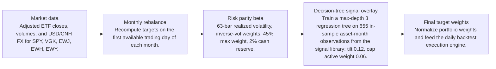
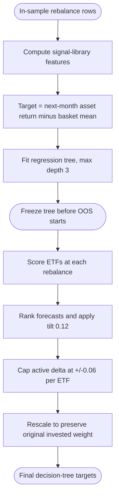

# Signal Comparison

- Baseline: SOTA: risk parity + relative momentum 126/252d regime
- Candidate: Research: risk parity + decision-tree-signal-d3-tilt-0p12
- Out-of-sample split: 2023-01-01
- Range: 2012-01-03 to 2026-04-29

| Window | Strategy | Return | Ann. Return | Max DD | Sharpe | Sortino | Calmar | Alpha vs Baseline |
| --- | --- | ---: | ---: | ---: | ---: | ---: | ---: | ---: |
| Full | SOTA: risk parity + relative momentum 126/252d regime | 281.84% | 9.81% | -29.60% | 0.68 | 0.64 | 0.33 | n/a |
| Full | Research: risk parity + decision-tree-signal-d3-tilt-0p12 | 298.64% | 10.14% | -29.34% | 0.70 | 0.66 | 0.35 | 16.79% |
| In Sample | SOTA: risk parity + relative momentum 126/252d regime | 110.19% | 6.99% | -29.60% | 0.51 | 0.47 | 0.24 | n/a |
| In Sample | Research: risk parity + decision-tree-signal-d3-tilt-0p12 | 119.72% | 7.43% | -29.34% | 0.54 | 0.50 | 0.25 | 9.52% |
| Out Of Sample | SOTA: risk parity + relative momentum 126/252d regime | 82.58% | 19.89% | -12.97% | 1.28 | 1.28 | 1.53 | n/a |
| Out Of Sample | Research: risk parity + decision-tree-signal-d3-tilt-0p12 | 82.42% | 19.86% | -12.88% | 1.28 | 1.30 | 1.54 | -0.16% |

Alpha here is candidate return minus baseline return over the same window.

## Model Structure

### Baseline / SOTA

- Name: SOTA: risk parity + relative momentum 126/252d regime
- State: sota
- Promoted on: 2026-05-05
- Description: Monthly risk parity with a regime-gated cross-sectional relative momentum tilt. This is the current research hurdle for new candidate strategies.

#### Layers

#### Decision Tree

### Research Candidate

- Name: Research: risk parity + decision-tree-signal-d3-tilt-0p12
- State: research
- Description: Research candidate using an in-sample-trained regression decision tree over the signal library.

#### Layers

#### Decision Tree

## Market Data Audit

- Source: SQLite var\systematic_trading.db
- Price field: close
- Adjusted prices validated: yes
- Required observations: 3601
- Common required observations: 3601

| Symbol | Obs. | Required Coverage | Missing Required | Max Gap Days | Stale Runs | Non-Positive |
| --- | ---: | ---: | ---: | ---: | ---: | ---: |
| EWH | 3601 | 100.00% | 0 | 5 | 2 | 0 |
| EWJ | 3601 | 100.00% | 0 | 5 | 1 | 0 |
| EWY | 3601 | 100.00% | 0 | 5 | 0 | 0 |
| SPY | 3601 | 100.00% | 0 | 5 | 0 | 0 |
| VGK | 3601 | 100.00% | 0 | 5 | 0 | 0 |

Warnings:
- EWH has 2 stale close-price runs of at least 3 observations.
- EWJ has 1 stale close-price runs of at least 3 observations.

## Signal Forecast Quality

- Lookback bars: 378
- Threshold: 0.00%
- Forward horizon: next_rebalance

| Window | Obs. | Positive Signals | Negative Signals | Positive Avg Fwd | Negative Avg Fwd | Spread | Accuracy | IC |
| --- | ---: | ---: | ---: | ---: | ---: | ---: | ---: | ---: |
| Full | 760 | 536 | 224 | 0.70% | 1.02% | -0.32% | 54.87% | -0.06 |
| In Sample | 565 | 407 | 158 | 0.31% | 1.09% | -0.77% | 54.34% | -0.09 |
| Out Of Sample | 195 | 129 | 66 | 1.92% | 0.86% | 1.06% | 56.41% | -0.00 |

### Forecast By Symbol

| Symbol | Obs. | Positive Avg Fwd | Negative Avg Fwd | Spread | Accuracy | IC |
| --- | ---: | ---: | ---: | ---: | ---: | ---: |
| EWY | 152 | 1.15% | 0.70% | 0.45% | 51.32% | -0.04 |
| EWH | 152 | 0.54% | 0.52% | 0.02% | 56.58% | -0.08 |
| EWJ | 152 | 0.50% | 1.20% | -0.70% | 51.97% | -0.10 |
| VGK | 152 | 0.39% | 1.35% | -0.96% | 51.32% | -0.10 |
| SPY | 152 | 0.93% | 3.31% | -2.39% | 63.16% | -0.12 |

## Signal Attribution

| Window | Periods | Positive | Negative | Est. Contribution | Compounded Delta | Avg. Period Delta |
| --- | ---: | ---: | ---: | ---: | ---: | ---: |
| Full | 168 | 93 | 75 | 4.32% | 16.79% | 0.03% |
| In Sample | 128 | 76 | 52 | 4.41% | 9.39% | 0.03% |
| Out Of Sample | 40 | 17 | 23 | -0.09% | -0.16% | -0.00% |

### Worst Signal Periods

| Period | Realized Delta | Est. Contribution | Main Negative |
| --- | ---: | ---: | --- |
| 2026-02-02 to 2026-03-02 | -0.58% | -0.59% | EWY underweight (-0.39%, asset 22.00%) |
| 2025-10-01 to 2025-11-03 | -0.40% | -0.41% | EWY underweight (-0.48%, asset 23.07%) |
| 2026-01-02 to 2026-02-02 | -0.39% | -0.39% | EWY underweight (-0.32%, asset 18.30%) |
| 2020-12-01 to 2021-01-04 | -0.30% | -0.30% | EWY underweight (-0.40%, asset 14.23%) |
| 2025-12-01 to 2026-01-02 | -0.23% | -0.24% | EWY underweight (-0.13%, asset 15.33%) |

### Best Signal Periods

| Period | Realized Delta | Est. Contribution | Main Positive |
| --- | ---: | ---: | --- |
| 2022-07-01 to 2022-08-01 | 0.55% | 0.55% | EWH underweight (0.27%, asset -4.83%) |
| 2022-11-01 to 2022-12-01 | 0.44% | 0.46% | EWH overweight (0.84%, asset 21.44%) |
| 2022-10-03 to 2022-11-01 | 0.40% | 0.39% | EWH underweight (0.20%, asset -9.78%) |
| 2023-01-03 to 2023-02-01 | 0.39% | 0.40% | EWY overweight (0.54%, asset 17.46%) |
| 2024-09-03 to 2024-10-01 | 0.36% | 0.37% | EWH overweight (0.39%, asset 20.68%) |

## Decision Quality

| Window | Active Decisions | Helped | Hurt | Hit Rate | False Exits | Good Exits | False Keeps | Est. Contribution |
| --- | ---: | ---: | ---: | ---: | ---: | ---: | ---: | ---: |
| Full | 837 | 433 | 404 | 51.73% | 245 | 180 | 0 | 4.32% |
| In Sample | 637 | 334 | 303 | 52.43% | 181 | 142 | 0 | 4.41% |
| Out Of Sample | 200 | 99 | 101 | 49.50% | 64 | 38 | 0 | -0.09% |

### Decision Quality By Symbol

| Symbol | Active | Helped | Hurt | Hit Rate | False Exits | False Keeps | Est. Contribution |
| --- | ---: | ---: | ---: | ---: | ---: | ---: | ---: |
| EWY | 168 | 72 | 96 | 42.86% | 48 | 0 | -2.14% |
| EWJ | 168 | 82 | 86 | 48.81% | 64 | 0 | -0.09% |
| VGK | 167 | 81 | 86 | 48.50% | 66 | 0 | 1.19% |
| EWH | 167 | 91 | 76 | 54.49% | 46 | 0 | 2.58% |
| SPY | 167 | 107 | 60 | 64.07% | 21 | 0 | 2.77% |

### Worst False Exits

| Period | Symbol | Action | Asset Return | Est. Contribution |
| --- | --- | --- | ---: | ---: |
| 2020-04-01 to 2020-05-01 | SPY | underweight | 14.89% | -0.62% |
| 2025-10-01 to 2025-11-03 | EWY | underweight | 23.07% | -0.48% |
| 2020-11-02 to 2020-12-01 | EWY | underweight | 18.01% | -0.40% |
| 2020-12-01 to 2021-01-04 | EWY | underweight | 14.23% | -0.40% |
| 2026-02-02 to 2026-03-02 | EWY | underweight | 22.00% | -0.39% |

### Worst False Keeps

| Period | Symbol | Asset Return |
| --- | --- | ---: |