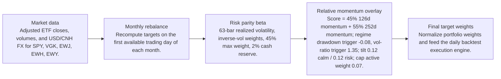
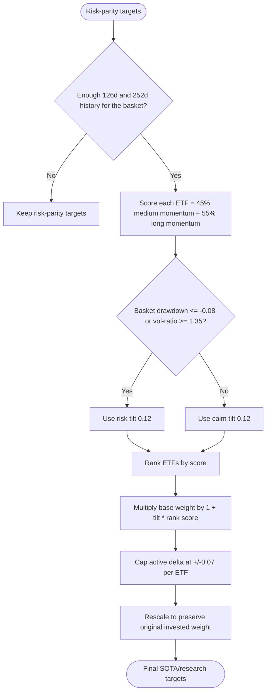
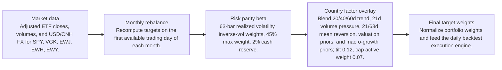
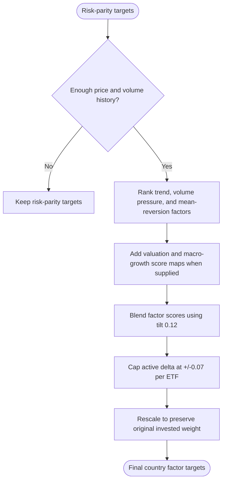

# Signal Comparison

- Baseline: SOTA: risk parity + relative momentum 126/252d regime
- Candidate: Research: risk parity + country-factor-20-40-60d-tilt-0p12
- Out-of-sample split: 2023-01-01
- Range: 2012-01-03 to 2026-04-29

| Window | Strategy | Return | Ann. Return | Max DD | Sharpe | Sortino | Calmar | Alpha vs Baseline |
| --- | --- | ---: | ---: | ---: | ---: | ---: | ---: | ---: |
| Full | SOTA: risk parity + relative momentum 126/252d regime | 281.84% | 9.81% | -29.60% | 0.68 | 0.64 | 0.33 | n/a |
| Full | Research: risk parity + country-factor-20-40-60d-tilt-0p12 | 280.95% | 9.79% | -29.40% | 0.68 | 0.64 | 0.33 | -0.89% |
| In Sample | SOTA: risk parity + relative momentum 126/252d regime | 110.19% | 6.99% | -29.60% | 0.51 | 0.47 | 0.24 | n/a |
| In Sample | Research: risk parity + country-factor-20-40-60d-tilt-0p12 | 109.89% | 6.98% | -29.40% | 0.51 | 0.47 | 0.24 | -0.30% |
| Out Of Sample | SOTA: risk parity + relative momentum 126/252d regime | 82.58% | 19.89% | -12.97% | 1.28 | 1.28 | 1.53 | n/a |
| Out Of Sample | Research: risk parity + country-factor-20-40-60d-tilt-0p12 | 82.49% | 19.88% | -12.91% | 1.28 | 1.29 | 1.54 | -0.09% |

Alpha here is candidate return minus baseline return over the same window.

## Model Structure

### Baseline / SOTA

- Name: SOTA: risk parity + relative momentum 126/252d regime
- State: sota
- Promoted on: 2026-05-05
- Description: Monthly risk parity with a regime-gated cross-sectional relative momentum tilt. This is the current research hurdle for new candidate strategies.

#### Layers

#### Decision Tree

### Research Candidate

- Name: Research: risk parity + country-factor-20-40-60d-tilt-0p12
- State: research
- Description: Research candidate using country ETF trend, volume, mean-reversion, valuation, and macro-growth factor tilts.

#### Layers

#### Decision Tree

## Market Data Audit

- Source: SQLite var\systematic_trading.db
- Price field: close
- Adjusted prices validated: yes
- Required observations: 3601
- Common required observations: 3601

| Symbol | Obs. | Required Coverage | Missing Required | Max Gap Days | Stale Runs | Non-Positive |
| --- | ---: | ---: | ---: | ---: | ---: | ---: |
| EWH | 3601 | 100.00% | 0 | 5 | 2 | 0 |
| EWJ | 3601 | 100.00% | 0 | 5 | 1 | 0 |
| EWY | 3601 | 100.00% | 0 | 5 | 0 | 0 |
| SPY | 3601 | 100.00% | 0 | 5 | 0 | 0 |
| VGK | 3601 | 100.00% | 0 | 5 | 0 | 0 |

Warnings:
- EWH has 2 stale close-price runs of at least 3 observations.
- EWJ has 1 stale close-price runs of at least 3 observations.

## Signal Forecast Quality

- Lookback bars: 126
- Threshold: 0.00%
- Forward horizon: next_rebalance

| Window | Obs. | Positive Signals | Negative Signals | Positive Avg Fwd | Negative Avg Fwd | Spread | Accuracy | IC |
| --- | ---: | ---: | ---: | ---: | ---: | ---: | ---: | ---: |
| Full | 820 | 537 | 283 | 0.73% | 1.11% | -0.39% | 54.02% | -0.01 |
| In Sample | 625 | 387 | 238 | 0.43% | 0.99% | -0.56% | 53.44% | -0.05 |
| Out Of Sample | 195 | 150 | 45 | 1.50% | 1.77% | -0.27% | 55.90% | 0.03 |

### Forecast By Symbol

| Symbol | Obs. | Positive Avg Fwd | Negative Avg Fwd | Spread | Accuracy | IC |
| --- | ---: | ---: | ---: | ---: | ---: | ---: |
| EWY | 164 | 1.08% | 0.69% | 0.38% | 52.44% | 0.06 |
| EWJ | 164 | 0.68% | 0.99% | -0.31% | 52.44% | -0.03 |
| VGK | 164 | 0.62% | 1.20% | -0.58% | 53.66% | -0.07 |
| EWH | 164 | 0.34% | 0.99% | -0.65% | 51.83% | -0.07 |
| SPY | 164 | 0.90% | 2.53% | -1.64% | 59.76% | -0.16 |

## Signal Attribution

| Window | Periods | Positive | Negative | Est. Contribution | Compounded Delta | Avg. Period Delta |
| --- | ---: | ---: | ---: | ---: | ---: | ---: |
| Full | 168 | 83 | 85 | -0.20% | -0.89% | -0.00% |
| In Sample | 128 | 68 | 60 | -0.21% | -0.39% | -0.00% |
| Out Of Sample | 40 | 15 | 25 | 0.01% | -0.09% | 0.00% |

### Worst Signal Periods

| Period | Realized Delta | Est. Contribution | Main Negative |
| --- | ---: | ---: | --- |
| 2024-01-02 to 2024-02-01 | -0.42% | -0.42% | EWY overweight (-0.14%, asset -5.31%) |
| 2024-06-03 to 2024-07-01 | -0.30% | -0.30% | EWH overweight (-0.16%, asset -6.36%) |
| 2013-01-02 to 2013-02-01 | -0.27% | -0.27% | EWY overweight (-0.15%, asset -8.36%) |
| 2026-01-02 to 2026-02-02 | -0.23% | -0.23% | EWY underweight (-0.19%, asset 18.30%) |
| 2022-03-01 to 2022-04-01 | -0.21% | -0.21% | VGK underweight (-0.13%, asset 4.09%) |

### Best Signal Periods

| Period | Realized Delta | Est. Contribution | Main Positive |
| --- | ---: | ---: | --- |
| 2025-06-02 to 2025-07-01 | 0.53% | 0.54% | EWY overweight (0.70%, asset 16.03%) |
| 2024-09-03 to 2024-10-01 | 0.48% | 0.49% | EWH overweight (0.57%, asset 20.68%) |
| 2014-07-01 to 2014-08-01 | 0.32% | 0.32% | VGK underweight (0.32%, asset -5.92%) |
| 2023-05-01 to 2023-06-01 | 0.28% | 0.27% | EWH underweight (0.25%, asset -8.22%) |
| 2023-01-03 to 2023-02-01 | 0.26% | 0.27% | EWY overweight (0.40%, asset 17.46%) |

## Decision Quality

| Window | Active Decisions | Helped | Hurt | Hit Rate | False Exits | Good Exits | False Keeps | Est. Contribution |
| --- | ---: | ---: | ---: | ---: | ---: | ---: | ---: | ---: |
| Full | 832 | 410 | 422 | 49.28% | 244 | 158 | 0 | -0.20% |
| In Sample | 634 | 313 | 321 | 49.37% | 184 | 126 | 0 | -0.21% |
| Out Of Sample | 198 | 97 | 101 | 48.99% | 60 | 32 | 0 | 0.01% |

### Decision Quality By Symbol

| Symbol | Active | Helped | Hurt | Hit Rate | False Exits | False Keeps | Est. Contribution |
| --- | ---: | ---: | ---: | ---: | ---: | ---: | ---: |
| SPY | 167 | 76 | 91 | 45.51% | 77 | 0 | -1.98% |
| EWY | 164 | 68 | 96 | 41.46% | 47 | 0 | -0.66% |
| EWH | 167 | 83 | 84 | 49.70% | 40 | 0 | -0.15% |
| EWJ | 167 | 90 | 77 | 53.89% | 44 | 0 | 0.66% |
| VGK | 167 | 93 | 74 | 55.69% | 36 | 0 | 1.93% |

### Worst False Exits

| Period | Symbol | Action | Asset Return | Est. Contribution |
| --- | --- | --- | ---: | ---: |
| 2020-04-01 to 2020-05-01 | SPY | underweight | 14.89% | -0.39% |
| 2019-01-02 to 2019-02-01 | SPY | underweight | 7.95% | -0.30% |
| 2022-11-01 to 2022-12-01 | EWH | underweight | 21.44% | -0.25% |
| 2020-11-02 to 2020-12-01 | SPY | underweight | 10.85% | -0.22% |
| 2020-11-02 to 2020-12-01 | VGK | underweight | 17.65% | -0.22% |

### Worst False Keeps

| Period | Symbol | Asset Return |
| --- | --- | ---: |