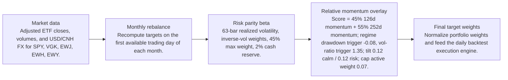
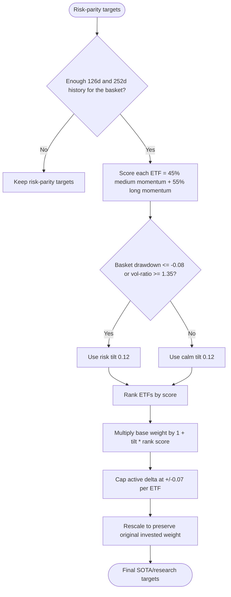
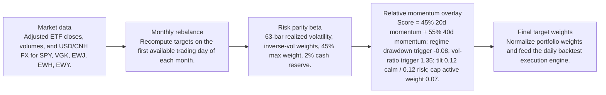

# Signal Comparison

- Baseline: SOTA: risk parity + relative momentum 126/252d regime
- Candidate: Research: risk parity + relative-momentum-20-40d-regime
- Out-of-sample split: 2023-01-01
- Range: 2012-01-03 to 2026-04-29

| Window | Strategy | Return | Ann. Return | Max DD | Sharpe | Sortino | Calmar | Alpha vs Baseline |
| --- | --- | ---: | ---: | ---: | ---: | ---: | ---: | ---: |
| Full | SOTA: risk parity + relative momentum 126/252d regime | 281.84% | 9.81% | -29.60% | 0.68 | 0.64 | 0.33 | n/a |
| Full | Research: risk parity + relative-momentum-20-40d-regime | 279.53% | 9.76% | -29.51% | 0.68 | 0.64 | 0.33 | -2.31% |
| In Sample | SOTA: risk parity + relative momentum 126/252d regime | 110.19% | 6.99% | -29.60% | 0.51 | 0.47 | 0.24 | n/a |
| In Sample | Research: risk parity + relative-momentum-20-40d-regime | 108.80% | 6.93% | -29.51% | 0.51 | 0.47 | 0.23 | -1.39% |
| Out Of Sample | SOTA: risk parity + relative momentum 126/252d regime | 82.58% | 19.89% | -12.97% | 1.28 | 1.28 | 1.53 | n/a |
| Out Of Sample | Research: risk parity + relative-momentum-20-40d-regime | 82.74% | 19.92% | -12.94% | 1.28 | 1.29 | 1.54 | 0.16% |

Alpha here is candidate return minus baseline return over the same window.

## Model Structure

### Baseline / SOTA

- Name: SOTA: risk parity + relative momentum 126/252d regime
- State: sota
- Promoted on: 2026-05-05
- Description: Monthly risk parity with a regime-gated cross-sectional relative momentum tilt. This is the current research hurdle for new candidate strategies.

#### Layers

#### Decision Tree

### Research Candidate

- Name: Research: risk parity + relative-momentum-20-40d-regime
- State: research
- Description: Research candidate using a regime-gated cross-sectional relative momentum overlay.

#### Layers

#### Decision Tree

## Market Data Audit

- Source: SQLite var\systematic_trading.db
- Price field: close
- Adjusted prices validated: yes
- Required observations: 3601
- Common required observations: 3601

| Symbol | Obs. | Required Coverage | Missing Required | Max Gap Days | Stale Runs | Non-Positive |
| --- | ---: | ---: | ---: | ---: | ---: | ---: |
| EWH | 3601 | 100.00% | 0 | 5 | 2 | 0 |
| EWJ | 3601 | 100.00% | 0 | 5 | 1 | 0 |
| EWY | 3601 | 100.00% | 0 | 5 | 0 | 0 |
| SPY | 3601 | 100.00% | 0 | 5 | 0 | 0 |
| VGK | 3601 | 100.00% | 0 | 5 | 0 | 0 |

Warnings:
- EWH has 2 stale close-price runs of at least 3 observations.
- EWJ has 1 stale close-price runs of at least 3 observations.

## Signal Forecast Quality

- Lookback bars: 40
- Threshold: 0.00%
- Forward horizon: next_rebalance

| Window | Obs. | Positive Signals | Negative Signals | Positive Avg Fwd | Negative Avg Fwd | Spread | Accuracy | IC |
| --- | ---: | ---: | ---: | ---: | ---: | ---: | ---: | ---: |
| Full | 835 | 525 | 310 | 0.80% | 0.86% | -0.06% | 53.17% | -0.07 |
| In Sample | 640 | 390 | 250 | 0.57% | 0.64% | -0.07% | 52.81% | -0.08 |
| Out Of Sample | 195 | 135 | 60 | 1.46% | 1.78% | -0.31% | 54.36% | -0.09 |

### Forecast By Symbol

| Symbol | Obs. | Positive Avg Fwd | Negative Avg Fwd | Spread | Accuracy | IC |
| --- | ---: | ---: | ---: | ---: | ---: | ---: |
| EWY | 167 | 1.08% | 0.55% | 0.52% | 52.69% | -0.02 |
| EWJ | 167 | 0.83% | 0.58% | 0.25% | 53.29% | -0.09 |
| EWH | 167 | 0.67% | 0.49% | 0.17% | 53.29% | -0.08 |
| VGK | 167 | 0.73% | 0.85% | -0.12% | 51.50% | -0.10 |
| SPY | 167 | 0.72% | 2.49% | -1.76% | 55.09% | -0.18 |

## Signal Attribution

| Window | Periods | Positive | Negative | Est. Contribution | Compounded Delta | Avg. Period Delta |
| --- | ---: | ---: | ---: | ---: | ---: | ---: |
| Full | 168 | 89 | 79 | -0.48% | -2.31% | -0.00% |
| In Sample | 128 | 72 | 56 | -0.63% | -1.45% | -0.01% |
| Out Of Sample | 40 | 17 | 23 | 0.15% | 0.16% | 0.00% |

### Worst Signal Periods

| Period | Realized Delta | Est. Contribution | Main Negative |
| --- | ---: | ---: | --- |
| 2024-01-02 to 2024-02-01 | -0.34% | -0.34% | EWY overweight (-0.14%, asset -5.31%) |
| 2024-06-03 to 2024-07-01 | -0.33% | -0.33% | EWH overweight (-0.16%, asset -6.36%) |
| 2013-01-02 to 2013-02-01 | -0.31% | -0.31% | EWY overweight (-0.19%, asset -8.36%) |
| 2022-03-01 to 2022-04-01 | -0.30% | -0.30% | SPY underweight (-0.18%, asset 5.66%) |
| 2013-06-03 to 2013-07-01 | -0.29% | -0.29% | EWJ underweight (-0.19%, asset 6.53%) |

### Best Signal Periods

| Period | Realized Delta | Est. Contribution | Main Positive |
| --- | ---: | ---: | --- |
| 2024-09-03 to 2024-10-01 | 0.89% | 0.91% | EWH overweight (1.05%, asset 20.68%) |
| 2025-06-02 to 2025-07-01 | 0.62% | 0.63% | EWY overweight (0.70%, asset 16.03%) |
| 2023-05-01 to 2023-06-01 | 0.37% | 0.36% | EWH underweight (0.31%, asset -8.22%) |
| 2014-07-01 to 2014-08-01 | 0.28% | 0.28% | VGK underweight (0.32%, asset -5.92%) |
| 2016-12-01 to 2017-01-03 | 0.20% | 0.20% | EWH underweight (0.11%, asset -4.61%) |

## Decision Quality

| Window | Active Decisions | Helped | Hurt | Hit Rate | False Exits | Good Exits | False Keeps | Est. Contribution |
| --- | ---: | ---: | ---: | ---: | ---: | ---: | ---: | ---: |
| Full | 778 | 410 | 368 | 52.70% | 208 | 157 | 17 | -0.48% |
| In Sample | 586 | 310 | 276 | 52.90% | 154 | 122 | 16 | -0.63% |
| Out Of Sample | 192 | 100 | 92 | 52.08% | 54 | 35 | 1 | 0.15% |

### Decision Quality By Symbol

| Symbol | Active | Helped | Hurt | Hit Rate | False Exits | False Keeps | Est. Contribution |
| --- | ---: | ---: | ---: | ---: | ---: | ---: | ---: |
| SPY | 156 | 66 | 90 | 42.31% | 70 | 3 | -2.31% |
| EWY | 155 | 76 | 79 | 49.03% | 34 | 3 | -1.40% |
| EWH | 156 | 91 | 65 | 58.33% | 32 | 4 | 0.87% |
| EWJ | 156 | 92 | 64 | 58.97% | 37 | 4 | 1.17% |
| VGK | 155 | 85 | 70 | 54.84% | 35 | 3 | 1.19% |

### Worst False Exits

| Period | Symbol | Action | Asset Return | Est. Contribution |
| --- | --- | --- | ---: | ---: |
| 2015-04-01 to 2015-05-01 | EWH | underweight | 7.96% | -0.43% |
| 2020-04-01 to 2020-05-01 | SPY | underweight | 14.89% | -0.34% |
| 2019-01-02 to 2019-02-01 | SPY | underweight | 7.95% | -0.33% |
| 2025-09-02 to 2025-10-01 | EWY | underweight | 13.86% | -0.32% |
| 2022-11-01 to 2022-12-01 | EWJ | underweight | 11.53% | -0.29% |

### Worst False Keeps

| Period | Symbol | Asset Return |
| --- | --- | ---: |
| 2014-09-02 to 2014-10-01 | EWY | -9.89% |
| 2014-09-02 to 2014-10-01 | EWH | -8.49% |
| 2013-05-01 to 2013-06-03 | EWJ | -7.43% |
| 2014-09-02 to 2014-10-01 | VGK | -4.90% |
| 2020-09-01 to 2020-10-01 | SPY | -4.03% |