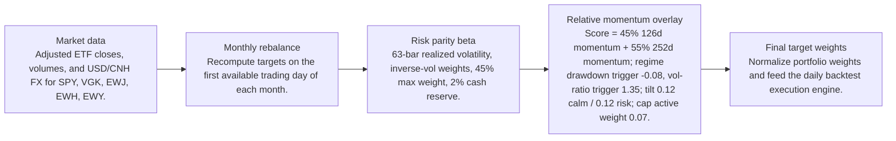
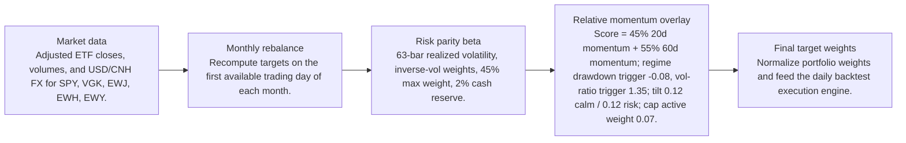
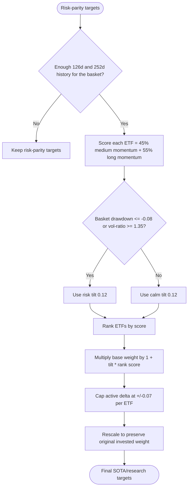

# Signal Comparison

- Baseline: SOTA: risk parity + relative momentum 126/252d regime
- Candidate: Research: risk parity + relative-momentum-20-60d-regime
- Out-of-sample split: 2023-01-01
- Range: 2012-01-03 to 2026-04-29

| Window | Strategy | Return | Ann. Return | Max DD | Sharpe | Sortino | Calmar | Alpha vs Baseline |
| --- | --- | ---: | ---: | ---: | ---: | ---: | ---: | ---: |
| Full | SOTA: risk parity + relative momentum 126/252d regime | 281.84% | 9.81% | -29.60% | 0.68 | 0.64 | 0.33 | n/a |
| Full | Research: risk parity + relative-momentum-20-60d-regime | 281.76% | 9.81% | -29.53% | 0.68 | 0.64 | 0.33 | -0.09% |
| In Sample | SOTA: risk parity + relative momentum 126/252d regime | 110.19% | 6.99% | -29.60% | 0.51 | 0.47 | 0.24 | n/a |
| In Sample | Research: risk parity + relative-momentum-20-60d-regime | 109.77% | 6.97% | -29.53% | 0.51 | 0.47 | 0.24 | -0.42% |
| Out Of Sample | SOTA: risk parity + relative momentum 126/252d regime | 82.58% | 19.89% | -12.97% | 1.28 | 1.28 | 1.53 | n/a |
| Out Of Sample | Research: risk parity + relative-momentum-20-60d-regime | 82.94% | 19.96% | -12.91% | 1.28 | 1.29 | 1.55 | 0.36% |

Alpha here is candidate return minus baseline return over the same window.

## Model Structure

### Baseline / SOTA

- Name: SOTA: risk parity + relative momentum 126/252d regime
- State: sota
- Promoted on: 2026-05-05
- Description: Monthly risk parity with a regime-gated cross-sectional relative momentum tilt. This is the current research hurdle for new candidate strategies.

#### Layers

#### Decision Tree

### Research Candidate

- Name: Research: risk parity + relative-momentum-20-60d-regime
- State: research
- Description: Research candidate using a regime-gated cross-sectional relative momentum overlay.

#### Layers

#### Decision Tree

## Market Data Audit

- Source: SQLite var\systematic_trading.db
- Price field: close
- Adjusted prices validated: yes
- Required observations: 3601
- Common required observations: 3601

| Symbol | Obs. | Required Coverage | Missing Required | Max Gap Days | Stale Runs | Non-Positive |
| --- | ---: | ---: | ---: | ---: | ---: | ---: |
| EWH | 3601 | 100.00% | 0 | 5 | 2 | 0 |
| EWJ | 3601 | 100.00% | 0 | 5 | 1 | 0 |
| EWY | 3601 | 100.00% | 0 | 5 | 0 | 0 |
| SPY | 3601 | 100.00% | 0 | 5 | 0 | 0 |
| VGK | 3601 | 100.00% | 0 | 5 | 0 | 0 |

Warnings:
- EWH has 2 stale close-price runs of at least 3 observations.
- EWJ has 1 stale close-price runs of at least 3 observations.

## Signal Forecast Quality

- Lookback bars: 60
- Threshold: 0.00%
- Forward horizon: next_rebalance

| Window | Obs. | Positive Signals | Negative Signals | Positive Avg Fwd | Negative Avg Fwd | Spread | Accuracy | IC |
| --- | ---: | ---: | ---: | ---: | ---: | ---: | ---: | ---: |
| Full | 835 | 515 | 320 | 0.76% | 0.92% | -0.16% | 53.17% | -0.08 |
| In Sample | 640 | 370 | 270 | 0.36% | 0.93% | -0.56% | 50.94% | -0.10 |
| Out Of Sample | 195 | 145 | 50 | 1.79% | 0.89% | 0.90% | 60.51% | -0.10 |

### Forecast By Symbol

| Symbol | Obs. | Positive Avg Fwd | Negative Avg Fwd | Spread | Accuracy | IC |
| --- | ---: | ---: | ---: | ---: | ---: | ---: |
| EWY | 167 | 1.32% | 0.31% | 1.01% | 50.90% | -0.03 |
| EWJ | 167 | 0.84% | 0.55% | 0.29% | 53.89% | -0.07 |
| EWH | 167 | 0.40% | 0.81% | -0.41% | 51.50% | -0.14 |
| VGK | 167 | 0.43% | 1.34% | -0.91% | 51.50% | -0.10 |
| SPY | 167 | 0.83% | 2.19% | -1.36% | 58.08% | -0.18 |

## Signal Attribution

| Window | Periods | Positive | Negative | Est. Contribution | Compounded Delta | Avg. Period Delta |
| --- | ---: | ---: | ---: | ---: | ---: | ---: |
| Full | 168 | 88 | 80 | 0.07% | -0.09% | 0.00% |
| In Sample | 128 | 70 | 58 | -0.19% | -0.46% | -0.00% |
| Out Of Sample | 40 | 18 | 22 | 0.26% | 0.36% | 0.01% |

### Worst Signal Periods

| Period | Realized Delta | Est. Contribution | Main Negative |
| --- | ---: | ---: | --- |
| 2024-01-02 to 2024-02-01 | -0.34% | -0.34% | EWY overweight (-0.14%, asset -5.31%) |
| 2013-01-02 to 2013-02-01 | -0.31% | -0.31% | EWY overweight (-0.19%, asset -8.36%) |
| 2022-03-01 to 2022-04-01 | -0.29% | -0.28% | VGK underweight (-0.14%, asset 4.09%) |
| 2018-03-01 to 2018-04-02 | -0.26% | -0.26% | EWY underweight (-0.12%, asset 3.43%) |
| 2024-06-03 to 2024-07-01 | -0.22% | -0.22% | EWH overweight (-0.11%, asset -6.36%) |

### Best Signal Periods

| Period | Realized Delta | Est. Contribution | Main Positive |
| --- | ---: | ---: | --- |
| 2025-06-02 to 2025-07-01 | 0.62% | 0.63% | EWY overweight (0.70%, asset 16.03%) |
| 2022-10-03 to 2022-11-01 | 0.36% | 0.35% | EWH underweight (0.28%, asset -9.78%) |
| 2014-07-01 to 2014-08-01 | 0.28% | 0.28% | VGK underweight (0.32%, asset -5.92%) |
| 2023-05-01 to 2023-06-01 | 0.22% | 0.22% | EWH underweight (0.21%, asset -8.22%) |
| 2023-01-03 to 2023-02-01 | 0.21% | 0.21% | EWY overweight (0.38%, asset 17.46%) |

## Decision Quality

| Window | Active Decisions | Helped | Hurt | Hit Rate | False Exits | Good Exits | False Keeps | Est. Contribution |
| --- | ---: | ---: | ---: | ---: | ---: | ---: | ---: | ---: |
| Full | 760 | 378 | 382 | 49.74% | 223 | 152 | 24 | 0.07% |
| In Sample | 589 | 299 | 290 | 50.76% | 171 | 127 | 14 | -0.19% |
| Out Of Sample | 171 | 79 | 92 | 46.20% | 52 | 25 | 10 | 0.26% |

### Decision Quality By Symbol

| Symbol | Active | Helped | Hurt | Hit Rate | False Exits | False Keeps | Est. Contribution |
| --- | ---: | ---: | ---: | ---: | ---: | ---: | ---: |
| SPY | 151 | 63 | 88 | 41.72% | 68 | 3 | -1.94% |
| EWH | 153 | 80 | 73 | 52.29% | 38 | 6 | -0.74% |
| EWY | 150 | 75 | 75 | 50.00% | 36 | 5 | 0.50% |
| EWJ | 154 | 77 | 77 | 50.00% | 45 | 5 | 0.53% |
| VGK | 152 | 83 | 69 | 54.61% | 36 | 5 | 1.72% |

### Worst False Exits

| Period | Symbol | Action | Asset Return | Est. Contribution |
| --- | --- | --- | ---: | ---: |
| 2020-04-01 to 2020-05-01 | SPY | underweight | 14.89% | -0.34% |
| 2020-05-01 to 2020-06-01 | EWJ | underweight | 10.62% | -0.30% |
| 2022-11-01 to 2022-12-01 | EWJ | underweight | 11.53% | -0.29% |
| 2015-10-01 to 2015-11-02 | EWJ | underweight | 7.82% | -0.27% |
| 2015-02-02 to 2015-03-02 | SPY | underweight | 4.99% | -0.26% |

### Worst False Keeps

| Period | Symbol | Asset Return |
| --- | --- | ---: |
| 2015-07-01 to 2015-08-03 | EWY | -9.51% |
| 2020-02-03 to 2020-03-02 | EWJ | -7.84% |
| 2023-09-01 to 2023-10-02 | EWY | -7.53% |
| 2023-09-01 to 2023-10-02 | EWH | -7.33% |
| 2020-02-03 to 2020-03-02 | VGK | -6.46% |