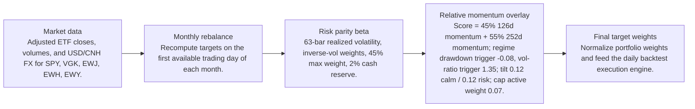
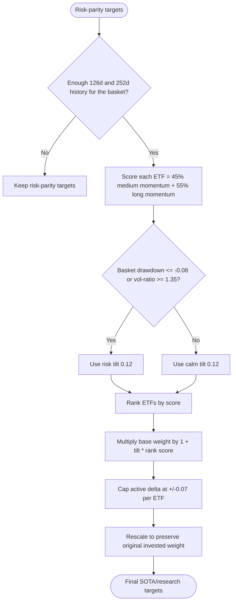
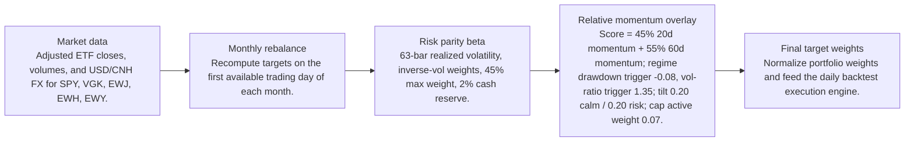
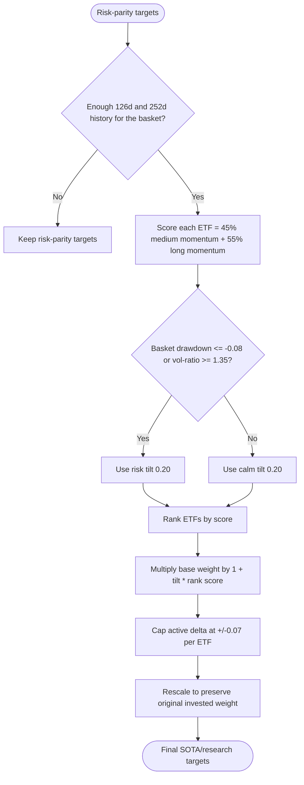

# Signal Comparison

- Baseline: SOTA: risk parity + relative momentum 126/252d regime
- Candidate: Research: risk parity + relative-momentum-20-60d-regime
- Out-of-sample split: 2023-01-01
- Range: 2012-01-03 to 2026-04-29

| Window | Strategy | Return | Ann. Return | Max DD | Sharpe | Sortino | Calmar | Alpha vs Baseline |
| --- | --- | ---: | ---: | ---: | ---: | ---: | ---: | ---: |
| Full | SOTA: risk parity + relative momentum 126/252d regime | 281.84% | 9.81% | -29.60% | 0.68 | 0.64 | 0.33 | n/a |
| Full | Research: risk parity + relative-momentum-20-60d-regime | 282.94% | 9.83% | -29.58% | 0.68 | 0.64 | 0.33 | 1.09% |
| In Sample | SOTA: risk parity + relative momentum 126/252d regime | 110.19% | 6.99% | -29.60% | 0.51 | 0.47 | 0.24 | n/a |
| In Sample | Research: risk parity + relative-momentum-20-60d-regime | 109.17% | 6.95% | -29.58% | 0.51 | 0.47 | 0.23 | -1.02% |
| Out Of Sample | SOTA: risk parity + relative momentum 126/252d regime | 82.58% | 19.89% | -12.97% | 1.28 | 1.28 | 1.53 | n/a |
| Out Of Sample | Research: risk parity + relative-momentum-20-60d-regime | 84.05% | 20.18% | -12.94% | 1.29 | 1.31 | 1.56 | 1.47% |

Alpha here is candidate return minus baseline return over the same window.

## Model Structure

### Baseline / SOTA

- Name: SOTA: risk parity + relative momentum 126/252d regime
- State: sota
- Promoted on: 2026-05-05
- Description: Monthly risk parity with a regime-gated cross-sectional relative momentum tilt. This is the current research hurdle for new candidate strategies.

#### Layers

#### Decision Tree

### Research Candidate

- Name: Research: risk parity + relative-momentum-20-60d-regime
- State: research
- Description: Research candidate using a regime-gated cross-sectional relative momentum overlay.

#### Layers

#### Decision Tree

## Market Data Audit

- Source: SQLite var\systematic_trading.db
- Price field: close
- Adjusted prices validated: yes
- Required observations: 3601
- Common required observations: 3601

| Symbol | Obs. | Required Coverage | Missing Required | Max Gap Days | Stale Runs | Non-Positive |
| --- | ---: | ---: | ---: | ---: | ---: | ---: |
| EWH | 3601 | 100.00% | 0 | 5 | 2 | 0 |
| EWJ | 3601 | 100.00% | 0 | 5 | 1 | 0 |
| EWY | 3601 | 100.00% | 0 | 5 | 0 | 0 |
| SPY | 3601 | 100.00% | 0 | 5 | 0 | 0 |
| VGK | 3601 | 100.00% | 0 | 5 | 0 | 0 |

Warnings:
- EWH has 2 stale close-price runs of at least 3 observations.
- EWJ has 1 stale close-price runs of at least 3 observations.

## Signal Forecast Quality

- Lookback bars: 60
- Threshold: 0.00%
- Forward horizon: next_rebalance

| Window | Obs. | Positive Signals | Negative Signals | Positive Avg Fwd | Negative Avg Fwd | Spread | Accuracy | IC |
| --- | ---: | ---: | ---: | ---: | ---: | ---: | ---: | ---: |
| Full | 835 | 515 | 320 | 0.76% | 0.92% | -0.16% | 53.17% | -0.08 |
| In Sample | 640 | 370 | 270 | 0.36% | 0.93% | -0.56% | 50.94% | -0.10 |
| Out Of Sample | 195 | 145 | 50 | 1.79% | 0.89% | 0.90% | 60.51% | -0.10 |

### Forecast By Symbol

| Symbol | Obs. | Positive Avg Fwd | Negative Avg Fwd | Spread | Accuracy | IC |
| --- | ---: | ---: | ---: | ---: | ---: | ---: |
| EWY | 167 | 1.32% | 0.31% | 1.01% | 50.90% | -0.03 |
| EWJ | 167 | 0.84% | 0.55% | 0.29% | 53.89% | -0.07 |
| EWH | 167 | 0.40% | 0.81% | -0.41% | 51.50% | -0.14 |
| VGK | 167 | 0.43% | 1.34% | -0.91% | 51.50% | -0.10 |
| SPY | 167 | 0.83% | 2.19% | -1.36% | 58.08% | -0.18 |

## Signal Attribution

| Window | Periods | Positive | Negative | Est. Contribution | Compounded Delta | Avg. Period Delta |
| --- | ---: | ---: | ---: | ---: | ---: | ---: |
| Full | 168 | 83 | 85 | 0.29% | 1.09% | 0.00% |
| In Sample | 128 | 60 | 68 | -0.59% | -1.07% | -0.00% |
| Out Of Sample | 40 | 23 | 17 | 0.88% | 1.47% | 0.02% |

### Worst Signal Periods

| Period | Realized Delta | Est. Contribution | Main Negative |
| --- | ---: | ---: | --- |
| 2013-01-02 to 2013-02-01 | -0.51% | -0.51% | EWY overweight (-0.31%, asset -8.36%) |
| 2022-03-01 to 2022-04-01 | -0.37% | -0.37% | VGK underweight (-0.20%, asset 4.09%) |
| 2018-03-01 to 2018-04-02 | -0.36% | -0.36% | SPY overweight (-0.16%, asset -3.44%) |
| 2024-01-02 to 2024-02-01 | -0.35% | -0.35% | EWY overweight (-0.20%, asset -5.31%) |
| 2024-09-03 to 2024-10-01 | -0.29% | -0.29% | EWH underweight (-0.31%, asset 20.68%) |

### Best Signal Periods

| Period | Realized Delta | Est. Contribution | Main Positive |
| --- | ---: | ---: | --- |
| 2025-06-02 to 2025-07-01 | 0.83% | 0.84% | EWY overweight (0.92%, asset 16.03%) |
| 2025-10-01 to 2025-11-03 | 0.44% | 0.44% | EWY overweight (0.29%, asset 23.07%) |
| 2022-10-03 to 2022-11-01 | 0.41% | 0.39% | EWH underweight (0.38%, asset -9.78%) |
| 2014-07-01 to 2014-08-01 | 0.33% | 0.33% | VGK underweight (0.44%, asset -5.92%) |
| 2020-07-01 to 2020-08-03 | 0.25% | 0.26% | EWY overweight (0.21%, asset 6.11%) |

## Decision Quality

| Window | Active Decisions | Helped | Hurt | Hit Rate | False Exits | Good Exits | False Keeps | Est. Contribution |
| --- | ---: | ---: | ---: | ---: | ---: | ---: | ---: | ---: |
| Full | 838 | 432 | 406 | 51.55% | 249 | 182 | 0 | 0.29% |
| In Sample | 638 | 322 | 316 | 50.47% | 189 | 137 | 0 | -0.59% |
| Out Of Sample | 200 | 110 | 90 | 55.00% | 60 | 45 | 0 | 0.88% |

### Decision Quality By Symbol

| Symbol | Active | Helped | Hurt | Hit Rate | False Exits | False Keeps | Est. Contribution |
| --- | ---: | ---: | ---: | ---: | ---: | ---: | ---: |
| SPY | 168 | 81 | 87 | 48.21% | 58 | 0 | -2.43% |
| EWH | 168 | 86 | 82 | 51.19% | 51 | 0 | -2.13% |
| EWJ | 168 | 85 | 83 | 50.60% | 53 | 0 | 0.68% |
| VGK | 167 | 91 | 76 | 54.49% | 43 | 0 | 2.02% |
| EWY | 167 | 89 | 78 | 53.29% | 44 | 0 | 2.15% |

### Worst False Exits

| Period | Symbol | Action | Asset Return | Est. Contribution |
| --- | --- | --- | ---: | ---: |
| 2022-11-01 to 2022-12-01 | EWH | underweight | 21.44% | -0.61% |
| 2020-11-02 to 2020-12-01 | VGK | underweight | 17.65% | -0.49% |
| 2020-05-01 to 2020-06-01 | EWJ | underweight | 10.62% | -0.39% |
| 2015-10-01 to 2015-11-02 | EWJ | underweight | 7.82% | -0.39% |
| 2022-11-01 to 2022-12-01 | EWJ | underweight | 11.53% | -0.38% |

### Worst False Keeps

| Period | Symbol | Asset Return |
| --- | --- | ---: |