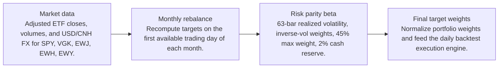
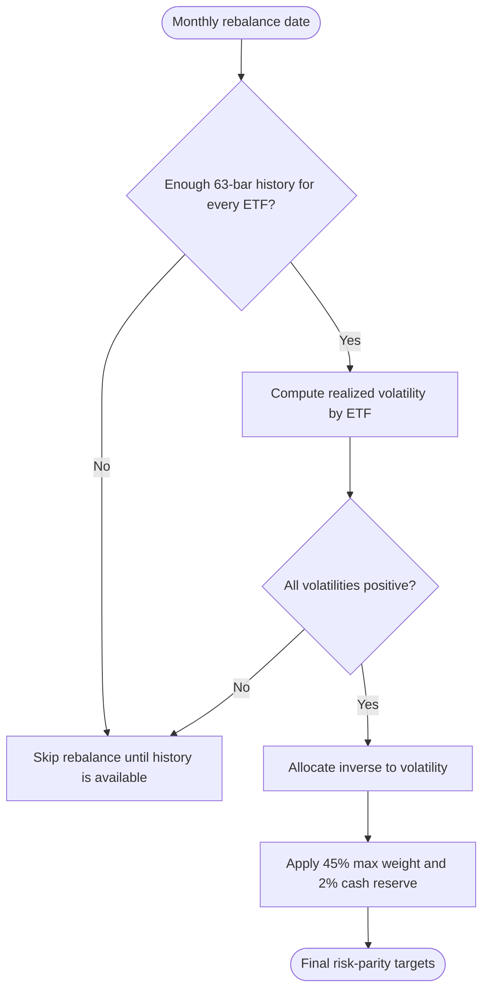
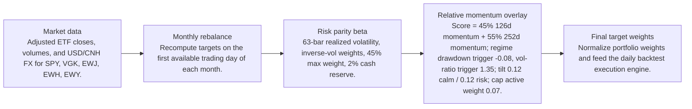
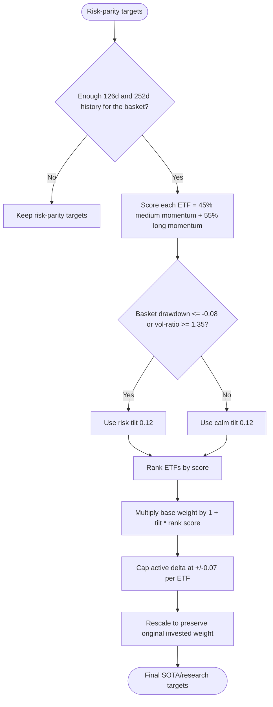

# Signal Comparison

- Baseline: Baseline risk parity
- Candidate: Research: risk parity + relative-momentum-126-252d-regime
- Out-of-sample split: 2023-01-01
- Range: 2012-01-03 to 2026-04-29

| Window | Strategy | Return | Ann. Return | Max DD | Sharpe | Sortino | Calmar | Alpha vs Baseline |
| --- | --- | ---: | ---: | ---: | ---: | ---: | ---: | ---: |
| Full | Baseline risk parity | 280.63% | 9.78% | -29.39% | 0.68 | 0.64 | 0.33 | n/a |
| Full | Research: risk parity + relative-momentum-126-252d-regime | 281.84% | 9.81% | -29.60% | 0.68 | 0.64 | 0.33 | 1.22% |
| In Sample | Baseline risk parity | 110.98% | 7.03% | -29.39% | 0.51 | 0.47 | 0.24 | n/a |
| In Sample | Research: risk parity + relative-momentum-126-252d-regime | 110.19% | 6.99% | -29.60% | 0.51 | 0.47 | 0.24 | -0.78% |
| Out Of Sample | Baseline risk parity | 81.34% | 19.65% | -12.86% | 1.27 | 1.28 | 1.53 | n/a |
| Out Of Sample | Research: risk parity + relative-momentum-126-252d-regime | 82.58% | 19.89% | -12.97% | 1.28 | 1.28 | 1.53 | 1.24% |

Alpha here is candidate return minus baseline return over the same window.

## Model Structure

### Baseline / SOTA

- Name: Baseline risk parity
- State: baseline
- Description: Monthly inverse-volatility ETF allocation with a max weight cap and cash reserve.

#### Layers

#### Decision Tree

### Research Candidate

- Name: Research: risk parity + relative-momentum-126-252d-regime
- State: research
- Description: Research candidate using a regime-gated cross-sectional relative momentum overlay.

#### Layers

#### Decision Tree

## Market Data Audit

- Source: SQLite var\systematic_trading.db
- Price field: close
- Adjusted prices validated: yes
- Required observations: 3601
- Common required observations: 3601

| Symbol | Obs. | Required Coverage | Missing Required | Max Gap Days | Stale Runs | Non-Positive |
| --- | ---: | ---: | ---: | ---: | ---: | ---: |
| EWH | 3601 | 100.00% | 0 | 5 | 2 | 0 |
| EWJ | 3601 | 100.00% | 0 | 5 | 1 | 0 |
| EWY | 3601 | 100.00% | 0 | 5 | 0 | 0 |
| SPY | 3601 | 100.00% | 0 | 5 | 0 | 0 |
| VGK | 3601 | 100.00% | 0 | 5 | 0 | 0 |

Warnings:
- EWH has 2 stale close-price runs of at least 3 observations.
- EWJ has 1 stale close-price runs of at least 3 observations.

## Signal Forecast Quality

- Lookback bars: 252
- Threshold: 0.00%
- Forward horizon: next_rebalance

| Window | Obs. | Positive Signals | Negative Signals | Positive Avg Fwd | Negative Avg Fwd | Spread | Accuracy | IC |
| --- | ---: | ---: | ---: | ---: | ---: | ---: | ---: | ---: |
| Full | 790 | 549 | 241 | 0.59% | 1.27% | -0.67% | 54.05% | -0.03 |
| In Sample | 595 | 400 | 195 | 0.29% | 1.10% | -0.81% | 53.61% | -0.06 |
| Out Of Sample | 195 | 149 | 46 | 1.42% | 2.00% | -0.58% | 55.38% | -0.00 |

### Forecast By Symbol

| Symbol | Obs. | Positive Avg Fwd | Negative Avg Fwd | Spread | Accuracy | IC |
| --- | ---: | ---: | ---: | ---: | ---: | ---: |
| EWY | 158 | 1.02% | 0.71% | 0.32% | 52.53% | 0.04 |
| EWJ | 158 | 0.62% | 1.04% | -0.42% | 54.43% | -0.11 |
| EWH | 158 | 0.04% | 1.29% | -1.26% | 49.37% | -0.08 |
| VGK | 158 | 0.24% | 1.69% | -1.45% | 50.00% | -0.12 |
| SPY | 158 | 0.97% | 2.85% | -1.87% | 63.92% | -0.10 |

## Signal Attribution

| Window | Periods | Positive | Negative | Est. Contribution | Compounded Delta | Avg. Period Delta |
| --- | ---: | ---: | ---: | ---: | ---: | ---: |
| Full | 168 | 85 | 75 | 0.25% | 1.22% | 0.00% |
| In Sample | 128 | 60 | 60 | -0.41% | -0.75% | -0.00% |
| Out Of Sample | 40 | 25 | 15 | 0.66% | 1.24% | 0.02% |

### Worst Signal Periods

| Period | Realized Delta | Est. Contribution | Main Negative |
| --- | ---: | ---: | --- |
| 2024-09-03 to 2024-10-01 | -0.44% | -0.45% | EWH underweight (-0.55%, asset 20.68%) |
| 2022-11-01 to 2022-12-01 | -0.31% | -0.32% | EWY underweight (-0.31%, asset 14.42%) |
| 2022-10-03 to 2022-11-01 | -0.31% | -0.30% | EWY underweight (-0.19%, asset 8.86%) |
| 2025-06-02 to 2025-07-01 | -0.30% | -0.31% | EWY underweight (-0.36%, asset 16.03%) |
| 2023-05-01 to 2023-06-01 | -0.29% | -0.28% | EWH overweight (-0.10%, asset -8.22%) |

### Best Signal Periods

| Period | Realized Delta | Est. Contribution | Main Positive |
| --- | ---: | ---: | --- |
| 2026-02-02 to 2026-03-02 | 0.41% | 0.41% | EWY overweight (0.31%, asset 22.00%) |
| 2024-01-02 to 2024-02-01 | 0.33% | 0.32% | EWH underweight (0.13%, asset -6.26%) |
| 2025-10-01 to 2025-11-03 | 0.31% | 0.31% | EWY overweight (0.36%, asset 23.07%) |
| 2013-04-01 to 2013-05-01 | 0.26% | 0.26% | EWJ overweight (0.25%, asset 11.46%) |
| 2026-01-02 to 2026-02-02 | 0.25% | 0.25% | EWY overweight (0.25%, asset 18.30%) |

## Decision Quality

| Window | Active Decisions | Helped | Hurt | Hit Rate | False Exits | Good Exits | False Keeps | Est. Contribution |
| --- | ---: | ---: | ---: | ---: | ---: | ---: | ---: | ---: |
| Full | 789 | 407 | 382 | 51.58% | 243 | 185 | 13 | 0.25% |
| In Sample | 590 | 303 | 287 | 51.36% | 178 | 141 | 13 | -0.41% |
| Out Of Sample | 199 | 104 | 95 | 52.26% | 65 | 44 | 0 | 0.66% |

### Decision Quality By Symbol

| Symbol | Active | Helped | Hurt | Hit Rate | False Exits | False Keeps | Est. Contribution |
| --- | ---: | ---: | ---: | ---: | ---: | ---: | ---: |
| EWH | 159 | 72 | 87 | 45.28% | 55 | 1 | -1.36% |
| VGK | 159 | 78 | 81 | 49.06% | 53 | 2 | -1.29% |
| EWJ | 156 | 79 | 77 | 50.64% | 51 | 4 | -0.27% |
| SPY | 158 | 90 | 68 | 56.96% | 30 | 3 | 1.22% |
| EWY | 157 | 88 | 69 | 56.05% | 54 | 3 | 1.95% |

### Worst False Exits

| Period | Symbol | Action | Asset Return | Est. Contribution |
| --- | --- | --- | ---: | ---: |
| 2024-09-03 to 2024-10-01 | EWH | underweight | 20.68% | -0.55% |
| 2025-06-02 to 2025-07-01 | EWY | underweight | 16.03% | -0.36% |
| 2023-01-03 to 2023-02-01 | EWY | underweight | 17.46% | -0.36% |
| 2022-11-01 to 2022-12-01 | EWY | underweight | 14.42% | -0.31% |
| 2022-11-01 to 2022-12-01 | EWH | underweight | 21.44% | -0.29% |

### Worst False Keeps

| Period | Symbol | Asset Return |
| --- | --- | ---: |
| 2012-05-01 to 2012-06-01 | VGK | -14.78% |
| 2012-05-01 to 2012-06-01 | EWY | -13.74% |
| 2012-05-01 to 2012-06-01 | EWH | -11.81% |
| 2012-05-01 to 2012-06-01 | EWJ | -10.27% |
| 2012-05-01 to 2012-06-01 | SPY | -8.94% |