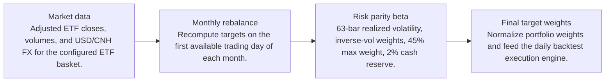
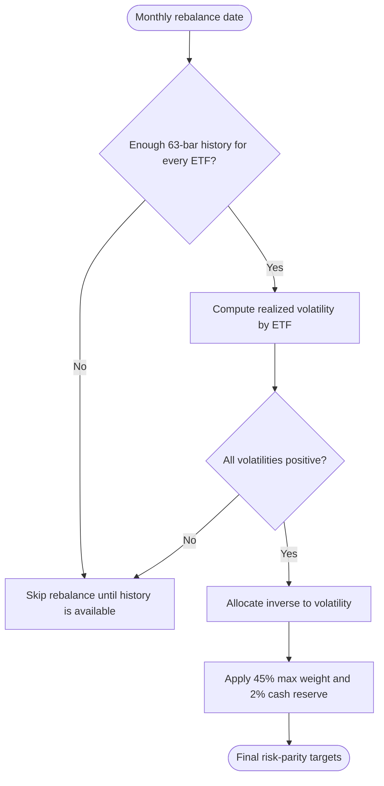
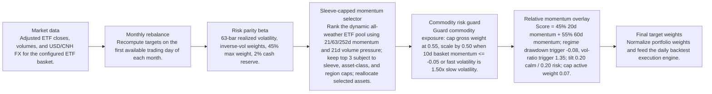
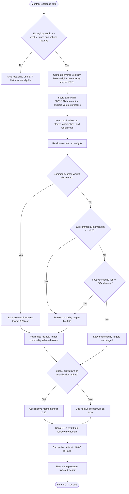

# Signal Comparison

- Baseline: Baseline risk parity
- Candidate: SOTA: dynamic sleeve-capped momentum + commodity guard
- Out-of-sample split: 2023-01-01
- Range: 2012-01-03 to 2026-04-29

| Window | Strategy | Return | Ann. Return | Max DD | Sharpe | Sortino | Calmar | Alpha vs Baseline | Info Ratio | Tracking Error |
| --- | --- | ---: | ---: | ---: | ---: | ---: | ---: | ---: | ---: | ---: |
| Full | Baseline risk parity | 55.45% | 3.13% | -12.37% | 0.52 | 0.51 | 0.25 | n/a | n/a | n/a |
| Full | SOTA: dynamic sleeve-capped momentum + commodity guard | 389.28% | 11.73% | -27.82% | 0.87 | 0.81 | 0.42 | 333.83% | 0.75 | 11.81% |
| In Sample | Baseline risk parity | 22.94% | 1.90% | -12.37% | 0.35 | 0.34 | 0.15 | n/a | n/a | n/a |
| In Sample | SOTA: dynamic sleeve-capped momentum + commodity guard | 80.44% | 5.52% | -20.97% | 0.49 | 0.44 | 0.26 | 57.50% | 0.38 | 10.98% |
| Out Of Sample | Baseline risk parity | 27.59% | 7.62% | -5.99% | 1.02 | 1.01 | 1.27 | n/a | n/a | n/a |
| Out Of Sample | SOTA: dynamic sleeve-capped momentum + commodity guard | 172.96% | 35.34% | -11.40% | 1.83 | 1.84 | 3.10 | 145.37% | 1.71 | 14.20% |

Alpha here is candidate return minus baseline return over the same window.

## Model Structure

### Baseline

- Name: Baseline risk parity
- State: baseline
- Description: Monthly inverse-volatility ETF allocation with a max weight cap and cash reserve.

#### Layers

#### Decision Tree

### Candidate

- Name: SOTA: dynamic sleeve-capped momentum + commodity guard
- State: sota
- Promoted on: 2026-05-17
- Description: Dynamic all-weather ETF universe with inverse-volatility base weights, global momentum selection, sleeve/asset/region caps, a monthly commodity risk guard, and the 20/60d regime-gated relative-momentum tilt. This is the current research hurdle for new candidate strategies.

#### Layers

#### Decision Tree

## Market Data Audit

- Source: SQLite var\systematic_trading.db
- Price field: close
- Adjusted prices validated: yes
- Required observations: 3601
- Common required observations: 2881

| Symbol | Obs. | Required Coverage | Missing Required | Max Gap Days | Stale Runs | Non-Positive |
| --- | ---: | ---: | ---: | ---: | ---: | ---: |
| BWX | 3601 | 100.00% | 0 | 5 | 6 | 0 |
| BWZ | 3601 | 100.00% | 0 | 5 | 1 | 0 |
| CBON | 2882 | 80.03% | 719 | 4 | 36 | 0 |
| CORN | 3601 | 100.00% | 0 | 5 | 1 | 0 |
| CPER | 3601 | 100.00% | 0 | 5 | 71 | 0 |
| DBA | 3601 | 100.00% | 0 | 5 | 1 | 0 |
| DBB | 3601 | 100.00% | 0 | 5 | 1 | 0 |
| DFE | 3601 | 100.00% | 0 | 5 | 0 | 0 |
| ECNS | 3601 | 100.00% | 0 | 5 | 3 | 0 |
| EPI | 3601 | 100.00% | 0 | 5 | 0 | 0 |
| EWJ | 3601 | 100.00% | 0 | 5 | 1 | 0 |
| EWT | 3601 | 100.00% | 0 | 5 | 1 | 0 |
| EWY | 3601 | 100.00% | 0 | 5 | 0 | 0 |
| FEZ | 3601 | 100.00% | 0 | 5 | 0 | 0 |
| FXI | 3601 | 100.00% | 0 | 5 | 0 | 0 |
| GLD | 3601 | 100.00% | 0 | 5 | 0 | 0 |
| HYG | 3601 | 100.00% | 0 | 5 | 1 | 0 |
| HYXU | 3537 | 98.22% | 64 | 5 | 2 | 0 |
| IBND | 3601 | 100.00% | 0 | 5 | 3 | 0 |
| IEF | 3601 | 100.00% | 0 | 5 | 1 | 0 |
| IGOV | 3601 | 100.00% | 0 | 5 | 0 | 0 |
| IWM | 3601 | 100.00% | 0 | 5 | 0 | 0 |
| LQD | 3601 | 100.00% | 0 | 5 | 0 | 0 |
| MCHI | 3601 | 100.00% | 0 | 5 | 0 | 0 |
| MDY | 3601 | 100.00% | 0 | 5 | 0 | 0 |
| PPLT | 3601 | 100.00% | 0 | 5 | 0 | 0 |
| SHY | 3601 | 100.00% | 0 | 5 | 43 | 0 |
| SLV | 3601 | 100.00% | 0 | 5 | 4 | 0 |
| SPY | 3601 | 100.00% | 0 | 5 | 0 | 0 |
| TIP | 3601 | 100.00% | 0 | 5 | 3 | 0 |
| TLT | 3601 | 100.00% | 0 | 5 | 0 | 0 |
| UNG | 3601 | 100.00% | 0 | 5 | 1 | 0 |
| USO | 3601 | 100.00% | 0 | 5 | 0 | 0 |
| VGK | 3601 | 100.00% | 0 | 5 | 0 | 0 |
| WEAT | 3601 | 100.00% | 0 | 5 | 5 | 0 |

Warnings:
- BWX has 6 stale close-price runs of at least 3 observations.
- BWZ has 1 stale close-price runs of at least 3 observations.
- CBON is missing 719 required price dates.
- CBON has 36 stale close-price runs of at least 3 observations.
- CORN has 1 stale close-price runs of at least 3 observations.
- CPER has 71 stale close-price runs of at least 3 observations.
- DBA has 1 stale close-price runs of at least 3 observations.
- DBB has 1 stale close-price runs of at least 3 observations.
- ECNS has 3 stale close-price runs of at least 3 observations.
- EWJ has 1 stale close-price runs of at least 3 observations.

## Signal Attribution

| Window | Periods | Positive | Negative | Est. Contribution | Compounded Delta | Avg. Period Delta | Info Ratio | Tracking Error |
| --- | ---: | ---: | ---: | ---: | ---: | ---: | ---: | ---: |
| Full | 159 | 98 | 61 | 128.91% | 337.16% | 0.81% | 0.73 | 13.42% |
| In Sample | 119 | 67 | 52 | 47.75% | 60.02% | 0.41% | 0.39 | 12.46% |
| Out Of Sample | 40 | 31 | 9 | 81.16% | 145.37% | 2.02% | 1.58 | 15.38% |

### Worst Signal Periods

| Period | Realized Delta | Est. Contribution | Main Negative |
| --- | ---: | ---: | --- |
| 2022-06-01 to 2022-07-01 | -10.49% | -10.47% | UNG overweight (-9.40%, asset -35.18%) |
| 2022-11-01 to 2022-12-01 | -8.77% | -9.01% | CORN overweight (-1.97%, asset -5.59%) |
| 2020-01-02 to 2020-02-03 | -7.35% | -7.39% | USO overweight (-3.53%, asset -18.11%) |
| 2018-10-01 to 2018-11-01 | -7.17% | -7.06% | SPY overweight (-2.99%, asset -6.25%) |
| 2021-11-01 to 2021-12-01 | -6.52% | -6.56% | USO overweight (-4.11%, asset -18.23%) |

### Best Signal Periods

| Period | Realized Delta | Est. Contribution | Main Positive |
| --- | ---: | ---: | --- |
| 2026-02-02 to 2026-03-02 | 15.20% | 15.45% | EWY overweight (14.98%, asset 22.00%) |
| 2025-12-01 to 2026-01-02 | 13.63% | 13.81% | EWY overweight (6.44%, asset 15.33%) |
| 2020-03-02 to 2020-04-01 | 12.54% | 12.25% | IEF overweight (2.30%, asset 4.22%) |
| 2022-04-01 to 2022-05-02 | 12.46% | 11.97% | UNG overweight (4.71%, asset 30.52%) |
| 2026-01-02 to 2026-02-02 | 12.38% | 12.50% | EWY overweight (11.85%, asset 18.30%) |

## Decision Quality

| Window | Active Decisions | Helped | Hurt | Hit Rate | False Exits | Good Exits | False Keeps | Est. Contribution |
| --- | ---: | ---: | ---: | ---: | ---: | ---: | ---: | ---: |
| Full | 5540 | 2596 | 2934 | 46.94% | 2737 | 2322 | 0 | 128.91% |
| In Sample | 4140 | 1977 | 2156 | 47.83% | 2004 | 1777 | 0 | 47.75% |
| Out Of Sample | 1400 | 619 | 778 | 44.31% | 733 | 545 | 0 | 81.16% |

### Decision Quality By Symbol

| Symbol | Active | Helped | Hurt | Hit Rate | False Exits | False Keeps | Est. Contribution |
| --- | ---: | ---: | ---: | ---: | ---: | ---: | ---: |
| MDY | 159 | 57 | 102 | 35.85% | 93 | 0 | -12.14% |
| PPLT | 159 | 75 | 84 | 47.17% | 80 | 0 | -4.97% |
| WEAT | 159 | 87 | 70 | 55.41% | 66 | 0 | -3.88% |
| UNG | 159 | 88 | 69 | 56.05% | 59 | 0 | -3.41% |
| SHY | 159 | 64 | 95 | 40.25% | 94 | 0 | -2.65% |
| TIP | 159 | 67 | 92 | 42.14% | 91 | 0 | -2.04% |
| VGK | 159 | 69 | 90 | 43.40% | 90 | 0 | -1.24% |
| CBON | 134 | 55 | 79 | 41.04% | 75 | 0 | -0.94% |
| FXI | 159 | 75 | 83 | 47.47% | 79 | 0 | -0.71% |
| EWJ | 159 | 70 | 89 | 44.03% | 83 | 0 | -0.62% |
| DBB | 159 | 75 | 84 | 47.17% | 80 | 0 | -0.50% |
| IBND | 159 | 82 | 77 | 51.57% | 76 | 0 | -0.35% |
| HYG | 159 | 57 | 102 | 35.85% | 100 | 0 | -0.12% |
| BWX | 159 | 82 | 77 | 51.57% | 76 | 0 | 0.31% |
| EWT | 159 | 66 | 93 | 41.51% | 83 | 0 | 0.88% |
| BWZ | 159 | 85 | 74 | 53.46% | 74 | 0 | 0.89% |
| SPY | 159 | 57 | 102 | 35.85% | 92 | 0 | 0.96% |
| IGOV | 159 | 83 | 75 | 52.53% | 75 | 0 | 1.21% |
| LQD | 159 | 72 | 87 | 45.28% | 85 | 0 | 2.30% |
| DBA | 159 | 76 | 82 | 48.10% | 76 | 0 | 2.34% |
| DFE | 159 | 68 | 91 | 42.77% | 79 | 0 | 2.87% |
| IEF | 159 | 72 | 87 | 45.28% | 82 | 0 | 3.42% |
| FEZ | 159 | 73 | 86 | 45.91% | 83 | 0 | 4.84% |
| EPI | 159 | 74 | 84 | 46.84% | 71 | 0 | 5.30% |
| HYXU | 159 | 82 | 76 | 51.90% | 73 | 0 | 5.34% |
| MCHI | 159 | 74 | 85 | 46.54% | 78 | 0 | 5.40% |
| IWM | 159 | 64 | 95 | 40.25% | 85 | 0 | 5.45% |
| ECNS | 159 | 77 | 82 | 48.43% | 76 | 0 | 6.54% |
| CPER | 159 | 78 | 80 | 49.37% | 74 | 0 | 7.74% |
| USO | 159 | 78 | 81 | 49.06% | 67 | 0 | 8.40% |
| GLD | 159 | 81 | 78 | 50.94% | 72 | 0 | 8.76% |
| TLT | 159 | 90 | 69 | 56.60% | 60 | 0 | 11.67% |
| SLV | 159 | 78 | 81 | 49.06% | 67 | 0 | 13.70% |
| CORN | 159 | 90 | 69 | 56.60% | 65 | 0 | 16.37% |
| EWY | 159 | 75 | 84 | 47.17% | 78 | 0 | 47.79% |

### Worst False Exits

| Period | Symbol | Action | Asset Return | Est. Contribution |
| --- | --- | --- | ---: | ---: |
| 2015-04-01 to 2015-05-01 | ECNS | cut | 24.92% | -0.50% |
| 2024-09-03 to 2024-10-01 | ECNS | cut | 29.22% | -0.48% |
| 2025-06-02 to 2025-07-01 | PPLT | cut | 26.67% | -0.45% |
| 2024-09-03 to 2024-10-01 | MCHI | cut | 28.19% | -0.44% |
| 2022-11-01 to 2022-12-01 | EWT | cut | 20.55% | -0.41% |

### Worst False Keeps

| Period | Symbol | Asset Return |
| --- | --- | ---: |