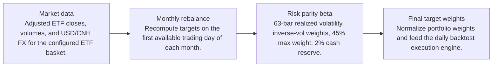
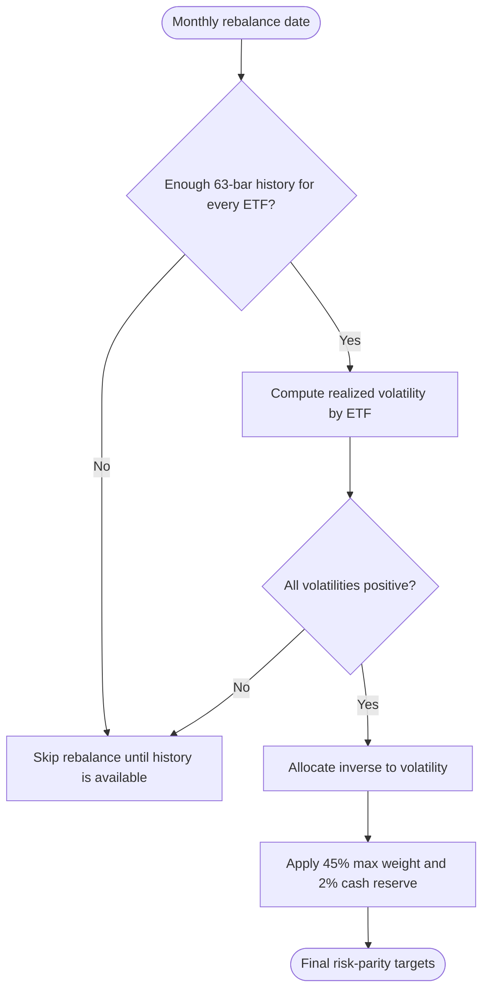

```mermaid
flowchart LR
  L1["Market data<br/>Adjusted ETF closes, volumes, and USD/CNH FX for the configured ETF basket."]
  L2["Monthly rebalance<br/>Recompute targets on the first available trading day of each month."]
  L1 --> L2
  L3["Risk parity beta<br/>63-bar realized volatility, inverse-vol weights, 45% max weight, 2% cash reserve."]
  L2 --> L3
  L4["Asset-pool filter overlay<br/>Rank assets using 63/126/252d momentum and 21d volume pressure; select top 6 with minimum 4; requires 252d momentum > 0; reallocate selected assets."]
  L3 --> L4
  L5["Decision-tree signal overlay<br/>Train a max-depth 3 regression tree on 1572 in-sample asset-month observations from the signal library; tilt 0.16, cap active weight 0.06."]
  L4 --> L5
  L6["Relative momentum overlay<br/>Score = 45% 20d momentum + 55% 60d momentum; regime drawdown trigger -0.08, vol-ratio trigger 1.35; tilt 0.12 calm / 0.12 risk; cap active weight 0.05."]
  L5 --> L6
  L7["Adaptive trend overlay<br/>Blend 63/126/252d trend, volume, rebound, and volatility shock gates; scales 0.50, 0.80, 0.35, 1.00."]
  L6 --> L7
  L8["Final target weights<br/>Normalize portfolio weights and feed the daily backtest execution engine."]
  L7 --> L8
```

# Signal Comparison

- Baseline: Baseline risk parity
- Candidate: SOTA: price/volume top 6 + technical tree + relative/adaptive
- Out-of-sample split: 2023-01-01
- Range: 2012-01-03 to 2026-04-29

| Window | Strategy | Return | Ann. Return | Max DD | Sharpe | Sortino | Calmar | Alpha vs Baseline | Info Ratio | Tracking Error |
| --- | --- | ---: | ---: | ---: | ---: | ---: | ---: | ---: | ---: | ---: |
| Full | Baseline risk parity | 113.62% | 5.44% | -16.92% | 0.70 | 0.68 | 0.32 | n/a | n/a | n/a |
| Full | SOTA: price/volume top 6 + technical tree + relative/adaptive | 248.22% | 9.10% | -14.11% | 0.95 | 0.89 | 0.65 | 134.60% | 0.63 | 5.69% |
| In Sample | Baseline risk parity | 53.87% | 4.00% | -16.92% | 0.54 | 0.52 | 0.24 | n/a | n/a | n/a |
| In Sample | SOTA: price/volume top 6 + technical tree + relative/adaptive | 107.94% | 6.89% | -14.11% | 0.77 | 0.71 | 0.49 | 54.07% | 0.49 | 5.84% |
| Out Of Sample | Baseline risk parity | 39.41% | 10.53% | -7.58% | 1.16 | 1.15 | 1.39 | n/a | n/a | n/a |
| Out Of Sample | SOTA: price/volume top 6 + technical tree + relative/adaptive | 67.98% | 16.92% | -8.46% | 1.48 | 1.44 | 2.00 | 28.57% | 1.13 | 5.17% |

Alpha here is candidate return minus baseline return over the same window.

## Model Structure

### Baseline

- Name: Baseline risk parity
- State: baseline
- Description: Monthly inverse-volatility ETF allocation with a max weight cap and cash reserve.

#### Layers



#### Decision Tree



### Candidate

- Name: SOTA: price/volume top 6 + technical tree + relative/adaptive
- State: sota
- Promoted on: 2026-05-26
- Description: Expanded multi-asset ETF universe with inverse-volatility base weights, a price/volume top-six pool filter, a frozen pre-2023 technical decision-tree tilt, a restrained 20/60d relative-momentum tilt, and adaptive trend exposure scaling. Promoted because it has the strongest stability-adjusted profile after penalizing weak in-sample Sharpe.

#### Layers



#### Decision Tree

```mermaid
flowchart TD
  A(["Risk-parity targets"]) --> B{"Enough price/volume history?"}
  B -- "No" --> C["Keep risk-parity targets"]
  B -- "Yes" --> D["Score assets with 63/126/252d momentum and 21d volume pressure"]
  D --> E{"252d momentum > 0?"}
  E -- "No" --> F["Remove from selected pool"]
  E -- "Yes" --> G["Rank and keep top 6 assets"]
  G --> H["Require at least 4 selected assets"]
  F --> I["Reallocate removed weight to selected assets"]
  H --> I
  I --> J(["Final filtered multi-asset targets"])

flowchart TD
  A(["In-sample rebalance rows"]) --> B["Compute signal-library features"]
  B --> C["Target = next-month asset return minus basket mean"]
  C --> D["Fit regression tree, max depth 3"]
  D --> E(["Freeze tree before OOS starts"])
  E --> F["Score ETFs at each rebalance"]
  F --> G["Rank forecasts and apply tilt 0.16"]
  G --> H["Cap active delta at +/-0.06 per ETF"]
  H --> I["Rescale to preserve original invested weight"]
  I --> J(["Final decision-tree targets"])

flowchart TD
  A(["Risk-parity targets"]) --> B{"Enough 20d and 60d history for the basket?"}
  B -- "No" --> C["Keep risk-parity targets"]
  B -- "Yes" --> D["Score each ETF = 45% 20d momentum + 55% 60d momentum"]
  D --> E{"Basket drawdown <= -0.08 or vol-ratio >= 1.35?"}
  E -- "Yes" --> F["Use risk tilt 0.12"]
  E -- "No" --> G["Use calm tilt 0.12"]
  F --> H["Rank ETFs by score"]
  G --> H
  H --> I["Multiply base weight by 1 + tilt * rank score"]
  I --> J["Cap active delta at +/-0.05 per ETF"]
  J --> K["Rescale to preserve original invested weight"]
  K --> L(["Final SOTA/research targets"])

flowchart TD
  A(["Risk-parity targets"]) --> B{"Enough short/medium/long trend history?"}
  B -- "No" --> C["Keep risk-parity targets"]
  B -- "Yes" --> D["Score trend across short, medium, and long windows"]
  D --> E{"Volatility shock?"}
  E -- "Yes" --> F["Use defensive scale 0.35"]
  E -- "No" --> G{"Rebound or volume confirmation?"}
  G -- "Yes" --> H["Use rebound/neutral scale up to 1.00"]
  G -- "No" --> I["Use weak/neutral/full trend scale starting at 0.50"]
  F --> J["Optionally reallocate residual to stronger assets"]
  H --> J
  I --> J
  J --> K(["Final adaptive targets"])
```

## Market Data Audit

- Source: SQLite var\systematic_trading.db
- Price field: close
- Adjusted prices validated: yes
- Required observations: 3601
- Common required observations: 3601

| Symbol | Obs. | Required Coverage | Missing Required | Max Gap Days | Stale Runs | Non-Positive |
| --- | ---: | ---: | ---: | ---: | ---: | ---: |
| DBC | 3601 | 100.00% | 0 | 5 | 0 | 0 |
| EWH | 3601 | 100.00% | 0 | 5 | 2 | 0 |
| EWJ | 3618 | 100.00% | 0 | 5 | 1 | 0 |
| EWY | 3618 | 100.00% | 0 | 5 | 0 | 0 |
| GLD | 3618 | 100.00% | 0 | 5 | 0 | 0 |
| HYG | 3618 | 100.00% | 0 | 5 | 1 | 0 |
| IEF | 3618 | 100.00% | 0 | 5 | 1 | 0 |
| LQD | 3618 | 100.00% | 0 | 5 | 0 | 0 |
| MCHI | 3618 | 100.00% | 0 | 5 | 0 | 0 |
| SPY | 3618 | 100.00% | 0 | 5 | 0 | 0 |
| TLT | 3618 | 100.00% | 0 | 5 | 0 | 0 |
| VGK | 3618 | 100.00% | 0 | 5 | 0 | 0 |

Warnings:
- EWH has 2 stale close-price runs of at least 3 observations.
- EWJ has 1 stale close-price runs of at least 3 observations.
- HYG has 1 stale close-price runs of at least 3 observations.
- IEF has 1 stale close-price runs of at least 3 observations.

## Signal Attribution

| Window | Periods | Positive | Negative | Est. Contribution | Compounded Delta | Avg. Period Delta | Info Ratio | Tracking Error |
| --- | ---: | ---: | ---: | ---: | ---: | ---: | ---: | ---: |
| Full | 168 | 102 | 66 | 51.69% | 134.60% | 0.30% | 0.74 | 4.81% |
| In Sample | 129 | 77 | 52 | 32.82% | 56.09% | 0.24% | 0.60 | 4.83% |
| Out Of Sample | 39 | 25 | 14 | 18.87% | 27.43% | 0.49% | 1.24 | 4.76% |

### Worst Signal Periods

| Period | Realized Delta | Est. Contribution | Main Negative |
| --- | ---: | ---: | --- |
| 2022-10-31 to 2022-11-30 | -5.38% | -5.32% | EWH underweight (-1.15%, asset 24.29%) |
| 2022-06-30 to 2022-07-29 | -4.01% | -3.88% | MCHI overweight (-1.08%, asset -10.97%) |
| 2019-12-31 to 2020-01-31 | -3.50% | -3.53% | DBC overweight (-0.77%, asset -8.59%) |
| 2015-01-30 to 2015-02-27 | -2.55% | -2.69% | TLT overweight (-0.40%, asset -6.14%) |
| 2013-12-31 to 2014-01-31 | -2.38% | -2.03% | IEF cut (-0.41%, asset 3.06%) |

### Best Signal Periods

| Period | Realized Delta | Est. Contribution | Main Positive |
| --- | ---: | ---: | --- |
| 2025-12-31 to 2026-01-30 | 5.32% | 4.79% | EWY overweight (1.56%, asset 25.91%) |
| 2020-02-28 to 2020-03-31 | 5.26% | 5.12% | HYG cut (1.63%, asset -10.03%) |
| 2026-01-30 to 2026-02-27 | 4.29% | 3.79% | EWY overweight (1.43%, asset 23.66%) |
| 2022-02-28 to 2022-03-31 | 4.06% | 4.37% | DBC overweight (1.84%, asset 9.17%) |
| 2017-12-29 to 2018-01-31 | 3.39% | 3.48% | VGK overweight (0.94%, asset 5.63%) |

## Decision Quality

| Window | Active Decisions | Helped | Hurt | Hit Rate | False Exits | Good Exits | False Keeps | Est. Contribution |
| --- | ---: | ---: | ---: | ---: | ---: | ---: | ---: | ---: |
| Full | 2016 | 1067 | 946 | 53.01% | 580 | 490 | 0 | 51.69% |
| In Sample | 1548 | 819 | 726 | 53.01% | 442 | 392 | 0 | 32.82% |
| Out Of Sample | 468 | 248 | 220 | 52.99% | 138 | 98 | 0 | 18.87% |

### Decision Quality By Symbol

| Symbol | Active | Helped | Hurt | Hit Rate | False Exits | False Keeps | Est. Contribution |
| --- | ---: | ---: | ---: | ---: | ---: | ---: | ---: |
| GLD | 168 | 90 | 78 | 53.57% | 41 | 0 | 0.81% |
| MCHI | 168 | 92 | 75 | 55.09% | 44 | 0 | 1.92% |
| TLT | 168 | 81 | 87 | 48.21% | 57 | 0 | 2.25% |
| VGK | 168 | 85 | 83 | 50.60% | 45 | 0 | 2.54% |
| LQD | 168 | 85 | 83 | 50.60% | 55 | 0 | 3.13% |
| EWH | 168 | 83 | 84 | 49.70% | 47 | 0 | 3.48% |
| HYG | 168 | 87 | 81 | 51.79% | 59 | 0 | 3.53% |
| IEF | 168 | 91 | 77 | 54.17% | 58 | 0 | 4.83% |
| DBC | 168 | 87 | 81 | 51.79% | 63 | 0 | 5.13% |
| EWY | 168 | 89 | 79 | 52.98% | 50 | 0 | 7.29% |
| EWJ | 168 | 94 | 73 | 56.29% | 37 | 0 | 7.77% |
| SPY | 168 | 103 | 65 | 61.31% | 24 | 0 | 9.02% |

### Worst False Exits

| Period | Symbol | Action | Asset Return | Est. Contribution |
| --- | --- | --- | ---: | ---: |
| 2022-10-31 to 2022-11-30 | EWH | underweight | 24.29% | -1.15% |
| 2024-08-30 to 2024-09-30 | MCHI | cut | 21.71% | -1.04% |
| 2022-10-31 to 2022-11-30 | MCHI | underweight | 32.12% | -0.92% |
| 2024-08-30 to 2024-09-30 | EWH | cut | 15.33% | -0.84% |
| 2023-10-31 to 2023-11-30 | EWY | cut | 14.72% | -0.82% |

### Worst False Keeps

| Period | Symbol | Asset Return |
| --- | --- | ---: |