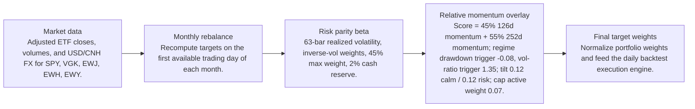
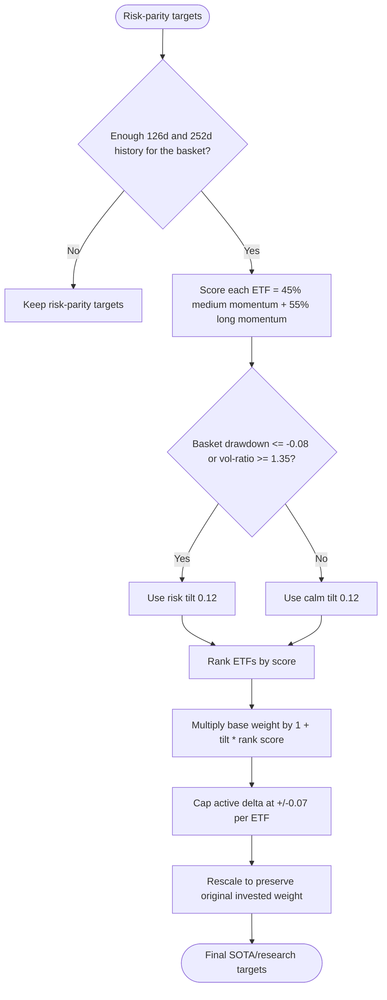
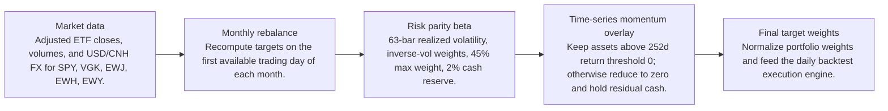
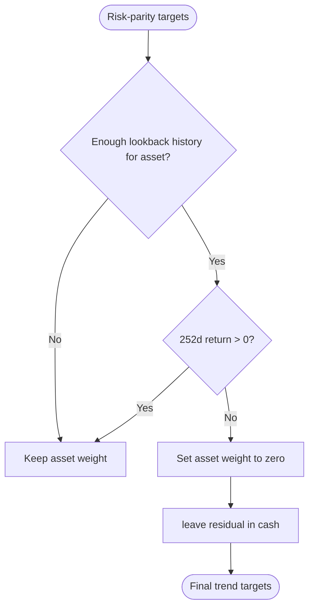

# Signal Comparison

- Baseline: SOTA: risk parity + relative momentum 126/252d regime
- Candidate: Research: risk parity + ts-momentum-252d-cash
- Out-of-sample split: 2023-01-01
- Range: 2012-01-03 to 2026-04-29

| Window | Strategy | Return | Ann. Return | Max DD | Sharpe | Sortino | Calmar | Alpha vs Baseline |
| --- | --- | ---: | ---: | ---: | ---: | ---: | ---: | ---: |
| Full | SOTA: risk parity + relative momentum 126/252d regime | 281.84% | 9.81% | -29.60% | 0.68 | 0.64 | 0.33 | n/a |
| Full | Research: risk parity + ts-momentum-252d-cash | 130.11% | 5.99% | -23.65% | 0.58 | 0.54 | 0.25 | -151.73% |
| In Sample | SOTA: risk parity + relative momentum 126/252d regime | 110.19% | 6.99% | -29.60% | 0.51 | 0.47 | 0.24 | n/a |
| In Sample | Research: risk parity + ts-momentum-252d-cash | 51.72% | 3.87% | -23.65% | 0.41 | 0.37 | 0.16 | -58.47% |
| Out Of Sample | SOTA: risk parity + relative momentum 126/252d regime | 82.58% | 19.89% | -12.97% | 1.28 | 1.28 | 1.53 | n/a |
| Out Of Sample | Research: risk parity + ts-momentum-252d-cash | 53.10% | 13.70% | -10.09% | 1.08 | 1.06 | 1.36 | -29.48% |

Alpha here is candidate return minus baseline return over the same window.

## Model Structure

### Baseline / SOTA

- Name: SOTA: risk parity + relative momentum 126/252d regime
- State: sota
- Promoted on: 2026-05-05
- Description: Monthly risk parity with a regime-gated cross-sectional relative momentum tilt. This is the current research hurdle for new candidate strategies.

#### Layers

#### Decision Tree

### Research Candidate

- Name: Research: risk parity + ts-momentum-252d-cash
- State: research
- Description: Research candidate using absolute time-series momentum gating.

#### Layers

#### Decision Tree

## Market Data Audit

- Source: SQLite var\systematic_trading.db
- Price field: close
- Adjusted prices validated: yes
- Required observations: 3601
- Common required observations: 3601

| Symbol | Obs. | Required Coverage | Missing Required | Max Gap Days | Stale Runs | Non-Positive |
| --- | ---: | ---: | ---: | ---: | ---: | ---: |
| EWH | 3601 | 100.00% | 0 | 5 | 2 | 0 |
| EWJ | 3601 | 100.00% | 0 | 5 | 1 | 0 |
| EWY | 3601 | 100.00% | 0 | 5 | 0 | 0 |
| SPY | 3601 | 100.00% | 0 | 5 | 0 | 0 |
| VGK | 3601 | 100.00% | 0 | 5 | 0 | 0 |

Warnings:
- EWH has 2 stale close-price runs of at least 3 observations.
- EWJ has 1 stale close-price runs of at least 3 observations.

## Signal Forecast Quality

- Lookback bars: 252
- Threshold: 0.00%
- Forward horizon: next_rebalance

| Window | Obs. | Positive Signals | Negative Signals | Positive Avg Fwd | Negative Avg Fwd | Spread | Accuracy | IC |
| --- | ---: | ---: | ---: | ---: | ---: | ---: | ---: | ---: |
| Full | 790 | 549 | 241 | 0.59% | 1.27% | -0.67% | 54.05% | -0.03 |
| In Sample | 595 | 400 | 195 | 0.29% | 1.10% | -0.81% | 53.61% | -0.06 |
| Out Of Sample | 195 | 149 | 46 | 1.42% | 2.00% | -0.58% | 55.38% | -0.00 |

### Forecast By Symbol

| Symbol | Obs. | Positive Avg Fwd | Negative Avg Fwd | Spread | Accuracy | IC |
| --- | ---: | ---: | ---: | ---: | ---: | ---: |
| EWY | 158 | 1.02% | 0.71% | 0.32% | 52.53% | 0.04 |
| EWJ | 158 | 0.62% | 1.04% | -0.42% | 54.43% | -0.11 |
| EWH | 158 | 0.04% | 1.29% | -1.26% | 49.37% | -0.08 |
| VGK | 158 | 0.24% | 1.69% | -1.45% | 50.00% | -0.12 |
| SPY | 158 | 0.97% | 2.85% | -1.87% | 63.92% | -0.10 |

## Signal Attribution

| Window | Periods | Positive | Negative | Est. Contribution | Compounded Delta | Avg. Period Delta |
| --- | ---: | ---: | ---: | ---: | ---: | ---: |
| Full | 168 | 64 | 96 | -58.94% | -151.73% | -0.34% |
| In Sample | 128 | 51 | 69 | -40.19% | -58.84% | -0.30% |
| Out Of Sample | 40 | 13 | 27 | -18.76% | -29.48% | -0.46% |

### Worst Signal Periods

| Period | Realized Delta | Est. Contribution | Main Negative |
| --- | ---: | ---: | --- |
| 2022-11-01 to 2022-12-01 | -12.68% | -13.08% | EWH cut (-4.49%, asset 21.44%) |
| 2020-04-01 to 2020-05-01 | -9.85% | -9.90% | SPY cut (-2.93%, asset 14.89%) |
| 2023-01-03 to 2023-02-01 | -8.40% | -8.58% | EWY cut (-2.66%, asset 17.46%) |
| 2015-10-01 to 2015-11-02 | -8.34% | -8.40% | SPY cut (-2.41%, asset 9.50%) |
| 2019-01-02 to 2019-02-01 | -7.65% | -7.85% | EWH cut (-1.95%, asset 9.31%) |

### Best Signal Periods

| Period | Realized Delta | Est. Contribution | Main Positive |
| --- | ---: | ---: | --- |
| 2020-03-02 to 2020-04-01 | 8.94% | 8.81% | EWJ cut (2.93%, asset -12.29%) |
| 2022-09-01 to 2022-10-03 | 8.38% | 8.14% | EWH cut (2.45%, asset -8.95%) |
| 2022-06-01 to 2022-07-01 | 6.35% | 6.33% | EWY cut (2.27%, asset -15.10%) |
| 2022-08-01 to 2022-09-01 | 5.50% | 5.40% | EWJ cut (1.76%, asset -6.89%) |
| 2018-12-03 to 2019-01-02 | 5.00% | 5.06% | EWJ cut (1.91%, asset -8.30%) |

## Decision Quality

| Window | Active Decisions | Helped | Hurt | Hit Rate | False Exits | Good Exits | False Keeps | Est. Contribution |
| --- | ---: | ---: | ---: | ---: | ---: | ---: | ---: | ---: |
| Full | 794 | 365 | 429 | 45.97% | 328 | 226 | 13 | -58.94% |
| In Sample | 594 | 279 | 315 | 46.97% | 245 | 182 | 13 | -40.19% |
| Out Of Sample | 200 | 86 | 114 | 43.00% | 83 | 44 | 0 | -18.76% |

### Decision Quality By Symbol

| Symbol | Active | Helped | Hurt | Hit Rate | False Exits | False Keeps | Est. Contribution |
| --- | ---: | ---: | ---: | ---: | ---: | ---: | ---: |
| VGK | 159 | 71 | 88 | 44.65% | 63 | 2 | -14.97% |
| EWH | 159 | 81 | 78 | 50.94% | 59 | 1 | -13.46% |
| EWY | 159 | 69 | 90 | 43.40% | 68 | 3 | -11.29% |
| SPY | 158 | 66 | 92 | 41.77% | 82 | 3 | -10.56% |
| EWJ | 159 | 78 | 81 | 49.06% | 56 | 4 | -8.66% |

### Worst False Exits

| Period | Symbol | Action | Asset Return | Est. Contribution |
| --- | --- | --- | ---: | ---: |
| 2022-11-01 to 2022-12-01 | EWH | cut | 21.44% | -4.49% |
| 2024-09-03 to 2024-10-01 | EWH | cut | 20.68% | -3.74% |
| 2020-04-01 to 2020-05-01 | SPY | cut | 14.89% | -2.93% |
| 2020-11-02 to 2020-12-01 | VGK | cut | 17.65% | -2.78% |
| 2022-11-01 to 2022-12-01 | EWJ | cut | 11.53% | -2.77% |

### Worst False Keeps

| Period | Symbol | Asset Return |
| --- | --- | ---: |
| 2012-05-01 to 2012-06-01 | VGK | -14.78% |
| 2012-05-01 to 2012-06-01 | EWY | -13.74% |
| 2012-05-01 to 2012-06-01 | EWH | -11.81% |
| 2012-05-01 to 2012-06-01 | EWJ | -10.27% |
| 2012-05-01 to 2012-06-01 | SPY | -8.94% |